Carregue o banco de dados `world` que está no pacote `poliscidata`.
-------------------------------------------------------------------

    library(poliscidata)

    banco <- world

Existem diversas medidas de democracia para os países: `dem_score14`, `democ11`, `fhrate04_rev`, `fhrate08_rev`, `polity`. Descreva-as graficamente e diga quais são as diferenças entre tais medidas.
------------------------------------------------------------------------------------------------------------------------------------------------------------------------------------------------------

    library(tidyverse)

    ## -- Attaching packages ------------------------------------ tidyverse 1.3.0 --

    ## v ggplot2 3.3.1     v purrr   0.3.4
    ## v tibble  3.0.1     v dplyr   1.0.0
    ## v tidyr   1.1.0     v stringr 1.4.0
    ## v readr   1.3.1     v forcats 0.5.0

    ## -- Conflicts --------------------------------------- tidyverse_conflicts() --
    ## x dplyr::filter() masks stats::filter()
    ## x dplyr::lag()    masks stats::lag()

**Gráficos dem\_score14:**

    ggplot(banco, aes(dem_score14)) +
      geom_boxplot() +
      theme_minimal()

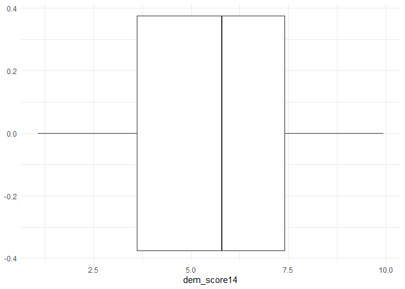

    ggplot(banco, aes(dem_score14)) +
      geom_density()+
      theme_minimal()

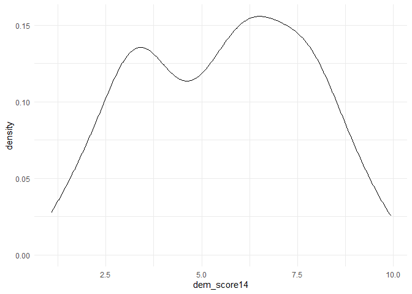

Esse gráfico em boxplot representa a variável dem\_score14. É uma
variável que mede o nível de democracia de cada país entre 0 e 10.
Podemos ver com o gráfico de boxplot que os segundo e terceiro quartis
têm a maior densidade de países. O segundo quartil tem valores entre 3.5
e 6 e o terceiro entre 6 e quase 7.5. Ou seja, a maoria dos países tem
níveis médios de democracia.

Com o gráfico de densidade, a gente pode ver que há dois picos, um em
mais ou menos 3.5 e outro maior em 6.5. Os países em 3.5 são
provavelmente regimes autoritários e os regimes em 6.5 são provavelmente
democracias.

**Gráficos de democ11:**

    ggplot(banco, aes(democ11)) +
      geom_boxplot()+
      theme_minimal()

    ## Warning: Removed 23 rows containing non-finite values (stat_boxplot).

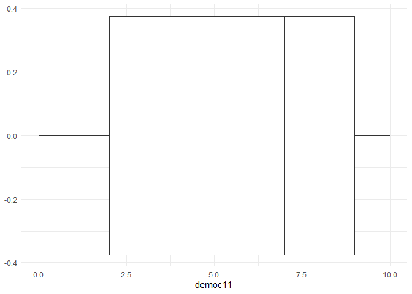

    ggplot(banco, aes(democ11)) +
      geom_density()+
      theme_minimal()

    ## Warning: Removed 23 rows containing non-finite values (stat_density).

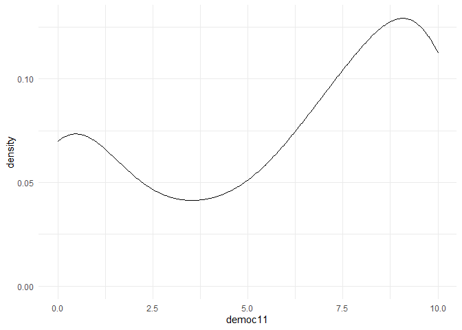

O gráfico em boxplot mostra que o terceiro (de quase 7 a quase 9) e o
quarto (de quase 9 a 10) quartis são aqueles que contêm mais
observações.Têm valores particularmente concentrados entre quase 7 e
quase 9, o terceiro quartil.

O gráfico de densidade mostra que há dois picos, um menor em 0.5 e outro
em quase 9. Podemos ver que há poucos valores médios.

Esse indício têm mais valores extremos. Interpretando, teria muitas
democracias quase plenas e alguns regimes muito autoritários.

Ou seja, esse indício deve utilizar definições muito mínimas de regimes:
ou é democracia ou é regime autoritário.

**Gráficos de fhrate04\_rev:**

    ggplot(banco, aes(fhrate04_rev)) +
      geom_boxplot()+
      theme_minimal()

    ## Warning: Removed 14 rows containing non-finite values (stat_boxplot).

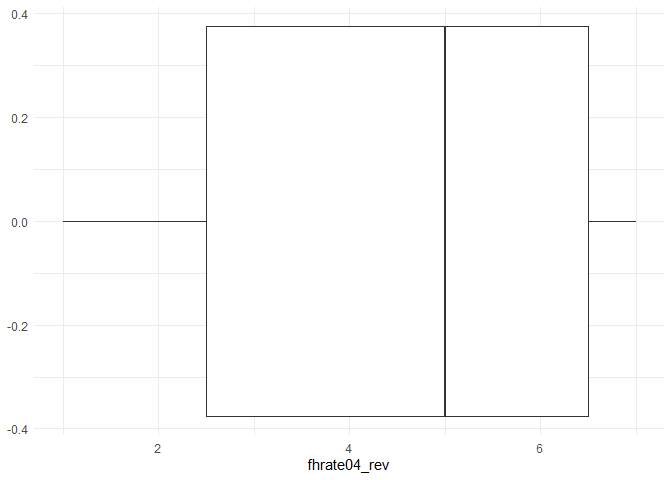

    ggplot(banco, aes(fhrate04_rev)) +
      geom_density()+
      theme_minimal()

    ## Warning: Removed 14 rows containing non-finite values (stat_density).

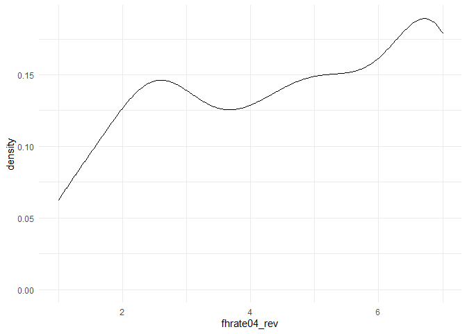

Podemos ver que os terceiro e quarto quartis são os mais concetrados. Ou
seja, visto que o indício é reverso, há mais democracias que regimes
autoritários. O gráfico de densidade reforça essa primeira observação.
Como outros gráficos precedentes (democ11), podemos ver dois picos, um
menor (em 2.5) e um maior (em 6.5). Porém, esses picos não são separados
por um abismo, a curva é quase sempre positiva entre os dois picos.
Então, há muitos regimes ambíguos e muitas democracias.

**Gráficos de fhrate08\_rev:**

    ggplot(banco, aes(fhrate08_rev)) +
      geom_boxplot()+
      theme_minimal()

    ## Warning: Removed 15 rows containing non-finite values (stat_boxplot).

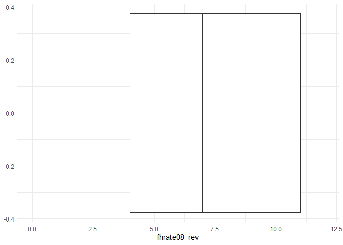

    ggplot(banco, aes(fhrate08_rev)) +
      geom_density()+
      theme_minimal()

    ## Warning: Removed 15 rows containing non-finite values (stat_density).

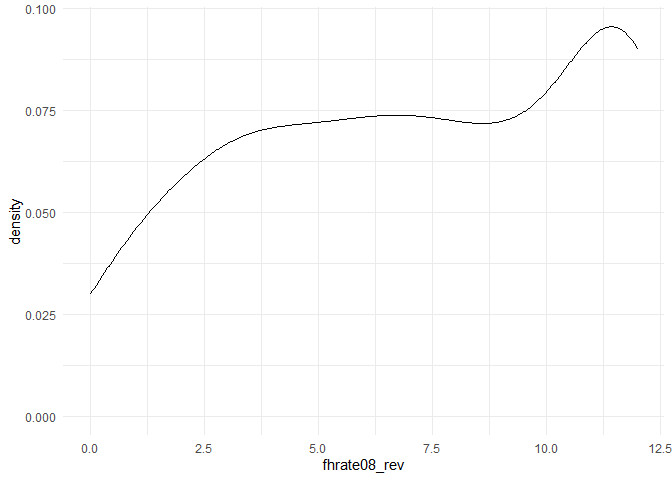

Nesse gráfico de boxplot de fhrate08\_rev, o segundo e o quarto quartis
são os mais concentrados. Ou seja, há muitos valores médios e muitos
valores altos. O gráfico de densidade mostra que o nível de democracia é
constante de 3 até 8.5 e sobe até atingir um pico em 11. Ou seja, há
muitos regimes ambíguos (entre 3 e 8.5) e muitas democracias.

Assumindo que 08 quer dizer 2008 e 04 2004, podemos observar uma
evolução do número de democracias de 2004 a 2008.

**Gráficos de polity:**

    ggplot(banco, aes(polity)) +
      geom_boxplot()+
      theme_minimal()

    ## Warning: Removed 23 rows containing non-finite values (stat_boxplot).

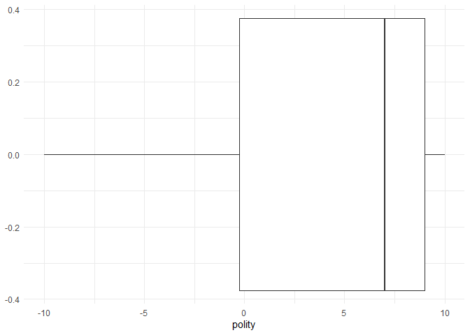

    ggplot(banco, aes(polity)) +
      geom_density()+
      theme_minimal()

    ## Warning: Removed 23 rows containing non-finite values (stat_density).

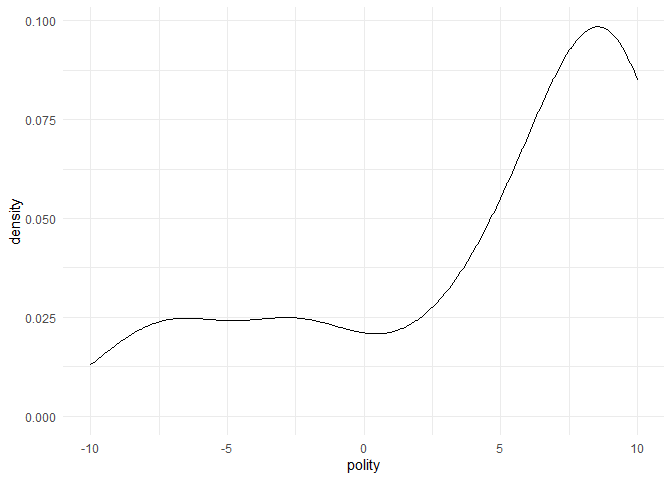

Esse gráfico de boxplot de polity mostra que há muitos valores
concentrados no terceiro e quarto quartil. O gráfico de densidade mostra
que há um número baixo e quase constante de regimes entre - 10 e 0 e que
o nível de democracia sobe até 8 onde atinge seu pico. Ou seja, tem
muito mais democracias do que regimes autoritários e ambíguos.

Ou seja, esse indício deve ter uma definição mínima de democracia.

**Recapitulando**, a maioria desses gráficos mostram que há muitas
democracias. Em função das definições das variáveis estudadas, tem mais
ou menos regimes ambíguos e mais ou menos regimes autoritários. *Com uma
quantidade significativa de regimes ambíguos: fhrate04\_rev,
fhrate08\_rev. *Com uma quantidade significativa regimes autoritários:
dem\_score14, democ11. \*Apenas com muitas democracias: polity.

Avalie a relação entre todas as medidas de democracia e desigualdade, utilizando a variável `gini08`. Descreva graficamente esta variável, a relação entre as duas variáveis, meça a correlação entre elas e faça regressões lineares (interpretando em profundidade os resultados dos coeficientes e medidas de desempenho dos modelos). Enfatize as semelhanças e diferenças entre os resultados. Quais são suas conclusões?
------------------------------------------------------------------------------------------------------------------------------------------------------------------------------------------------------------------------------------------------------------------------------------------------------------------------------------------------------------------------------------------------------------------------------

**Gráficos do indício de Gini:**

    ggplot(banco, aes(gini08)) +
      geom_boxplot()+
      theme_minimal()

    ## Warning: Removed 45 rows containing non-finite values (stat_boxplot).

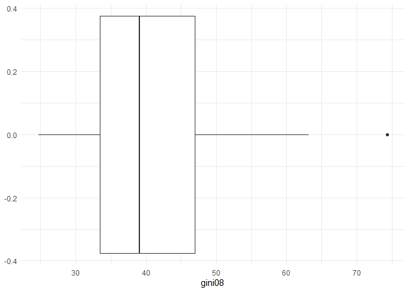

    ggplot(banco, aes(gini08)) +
      geom_density()+
      theme_minimal()

    ## Warning: Removed 45 rows containing non-finite values (stat_density).

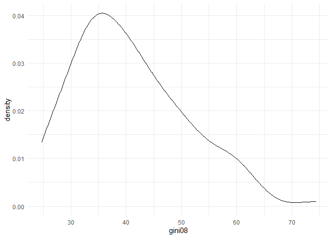

Podemos ver no gráfico de boxplot que a maioria dos países estão
concentrados entre 33 e 47 no indício de Gini. O gráfico de densidade
confirma isso: há um pico em 36. Ou seja, a maioria dos países têm um
indício de Gini médio-fraco, abaixo de 50.

Para avaliar a relação entre o indício de Gini e as variáveis que medem
a democracia, eu vou considerar que eu quero achar o nível de democracia
a partir do indício de Gini. Ou seja, gini08 vai ser minha variável
independente, x, e as variáveis que medem o nível de democracia serão
minhas variáveis dependentes, y.

### Comparação entre gini08 e dem\_score14

**Gráfico de gini08 em relação a dem\_score14:**

    ggplot(banco, aes(gini08, dem_score14)) +
      geom_point(alpha = 0.1)+
      theme_minimal()

    ## Warning: Removed 45 rows containing missing values (geom_point).

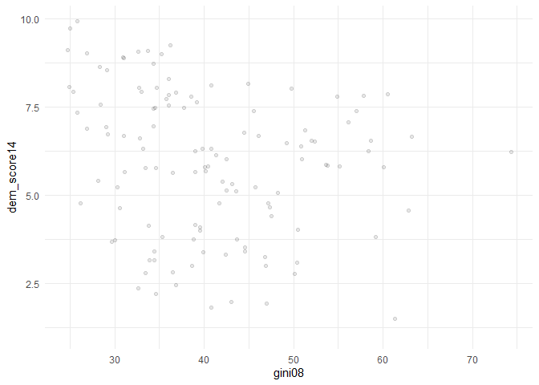

Nesse gráfico, conseguimos destacar que, de maneira geral, países mais
democráticos tem indícios de Gini mais fracos, ou seja, são menos
desiguais. Além disso, países menos democráticos têm indícios de Gini
mais altos, ou seja, são mais desiguais.

**Teste de correlação entre gini08 e dem\_score14:**

    cor.test(banco$gini08, banco$dem_score14)

    ## 
    ##  Pearson's product-moment correlation
    ## 
    ## data:  banco$gini08 and banco$dem_score14
    ## t = -2.4621, df = 120, p-value = 0.01523
    ## alternative hypothesis: true correlation is not equal to 0
    ## 95 percent confidence interval:
    ##  -0.38215203 -0.04321115
    ## sample estimates:
    ##        cor 
    ## -0.2192877

O coeficiente de correlação entre o indício de Gini e dem\_score14 é
fraco e negativo (-0.2192877). Esse resultado é confiável porque o
p-valor é menor do que 0.05, tem valor de 0.01523. Apesar do intervalo
de confiança ser pequeno, a correlação sendo fraca, não poderemos ter
boas previsões com essa correlação. Porém, é o melhor modelo que temos
nessa questão.

Esse teste de correlação confirma o gráfico.

**Regressão Linear entre gini08 e dem\_score14:**

    regressao <- lm(dem_score14 ~ gini08, data = banco)
    summary(regressao)

    ## 
    ## Call:
    ## lm(formula = dem_score14 ~ gini08, data = banco)
    ## 
    ## Residuals:
    ##     Min      1Q  Median      3Q     Max 
    ## -4.0728 -1.7583  0.3513  1.6742  3.3600 
    ## 
    ## Coefficients:
    ##             Estimate Std. Error t value Pr(>|t|)    
    ## (Intercept)  7.71756    0.75639  10.203   <2e-16 ***
    ## gini08      -0.04448    0.01807  -2.462   0.0152 *  
    ## ---
    ## Signif. codes:  0 '***' 0.001 '**' 0.01 '*' 0.05 '.' 0.1 ' ' 1
    ## 
    ## Residual standard error: 2.003 on 120 degrees of freedom
    ##   (45 observations deleted due to missingness)
    ## Multiple R-squared:  0.04809,    Adjusted R-squared:  0.04015 
    ## F-statistic: 6.062 on 1 and 120 DF,  p-value: 0.01523

O valor do Intercept, ou do alpha, não é muito significativo. Assim,
nesse caso, quer dizer que se o valor do indício de Gini fosse zero, o
nível de democracia seria 7.71756. Porém, sabemos que existem muitos
países com níveis de democracia abaixo disso.

O estimate de gini08 nos indica que quando o indício de Gini sobe de um
ponto, o nível de democracia (dem\_score14) diminui de 0.04448, o que é
pouco. O erro sobre esse valor é de 0.01807, ou seja quase a metade do
estimate. Por essa razão, por que o erro é grande em relação ao
estimate, o t não é muito grande -2.462. Enfim, esse estimate tem um
p-valor bom de 0.0152, menor do que 0.05, o aue indica uma significância
estatística.

O RMSE é grande: 2.003. Ou seja, se a gente fosse prever o nível de
democracia de um país a partir do seu indício de Gini, esse modelo teria
um erro médio de 2.003, o que é grande.

Enfim, o Multiple R-squared é baixo: 0.04809, ou seja, menos 5%. Isso
significa que a variação do nível de democracia é pouco explicada pela
variação no nível de produção de petróleo.

**Gráfico da regressão linear entre gini08 e dem\_score14:**

    ggplot(banco, aes(gini08, dem_score14)) +
      geom_point() +
      geom_smooth(method = "lm")+
      theme_minimal()

    ## `geom_smooth()` using formula 'y ~ x'

    ## Warning: Removed 45 rows containing non-finite values (stat_smooth).

    ## Warning: Removed 45 rows containing missing values (geom_point).

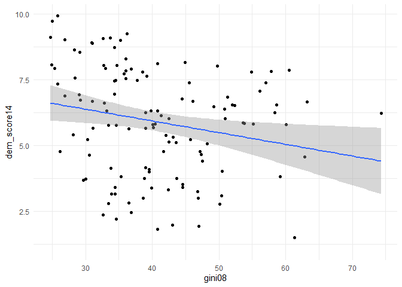

Nesse gráfico, podemos ver que a relação entre gini08 e dem\_score14 é
negativa e o declive é baixo. Podemos também observar que o erro é maior
a medida que o valor de gini08 se distancia de mais ou menos 40. Talvez
isso tenha a ver com o fato que mais o nível de gini08 aumenta, menos há
observações.

### Comparação entre gini 08 e democ11

**Gráfico de gini08 em relação a democ11:**

    ggplot(banco, aes(gini08, democ11)) +
      geom_point(alpha = 0.1)+
      theme_minimal()

    ## Warning: Removed 52 rows containing missing values (geom_point).

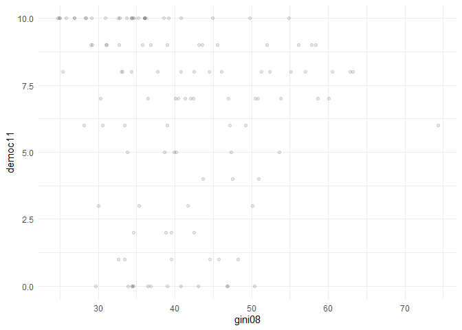

Nesse gráfico, conseguimos destacar que, de maneira geral, países mais
democráticos tem indícios de Gini mais fracos, ou seja, são menos
desiguais, e que países menos democráticos têm indícios de Gini mais
altos, ou seja, são mais desiguais. Porém, vemos que essa evolução
negativa não fica tão clara nesse gráfico como no precedente porque
muitos países são considerados democráticos (10) ou não democráticos (0)
e têm indícios de Gini diversos.

**Teste de correlação entre gini 08 e democ11:**

    cor.test(banco$gini08, banco$democ11)

    ## 
    ##  Pearson's product-moment correlation
    ## 
    ## data:  banco$gini08 and banco$democ11
    ## t = -0.90439, df = 113, p-value = 0.3677
    ## alternative hypothesis: true correlation is not equal to 0
    ## 95 percent confidence interval:
    ##  -0.26378781  0.09988899
    ## sample estimates:
    ##         cor 
    ## -0.08477203

O coeficiente de correlação entre o indício de Gini e democ11 é muito
fraco e negativo (-0.08477203). Esse resultado não é confiável porque o
p-value é maior do que 0.05, tem valor de 0.3677. Além disso, o
intervalo de confiança contém zero. Com todos esses resultados,
concluimos que essa correlação é péssima, não podemos fazer previsões
com ela.

Esse teste de correlação confirma o gráfico.

**Regressão Linear entre gini 08 e democ11:**

    regressao <- lm(democ11 ~ gini08, data = banco)
    summary(regressao)

    ## 
    ## Call:
    ## lm(formula = democ11 ~ gini08, data = banco)
    ## 
    ## Residuals:
    ##    Min     1Q Median     3Q    Max 
    ## -6.796 -2.213  1.302  3.049  3.958 
    ## 
    ## Coefficients:
    ##             Estimate Std. Error t value Pr(>|t|)    
    ## (Intercept)  7.68568    1.38306   5.557 1.85e-07 ***
    ## gini08      -0.02994    0.03311  -0.904    0.368    
    ## ---
    ## Signif. codes:  0 '***' 0.001 '**' 0.01 '*' 0.05 '.' 0.1 ' ' 1
    ## 
    ## Residual standard error: 3.47 on 113 degrees of freedom
    ##   (52 observations deleted due to missingness)
    ## Multiple R-squared:  0.007186,   Adjusted R-squared:  -0.0016 
    ## F-statistic: 0.8179 on 1 and 113 DF,  p-value: 0.3677

O valor do Intercept, ou do alpha, não é significativo pelas mesmas
razoes que na regressão anterior.

O estimate de gini08 nos indica que quando o indício de Gini sobe de um
ponto, o nível de democracia (democ11) diminui de 0.02994, o que é
pouco. O erro sobre esse valor é de 0.03311, ou seja é maior do que o
estimate. Por essa razão, por que o erro é grande em relação ao
estimate, o t não é é pequeno -0.904. Enfim, esse estimate tem um
p-valor ruim de 0.368, maior do que 0.05.

O RMSE é gigante: 3.47. Ou seja, se a gente fosse prever o nível de
democracia de um país a partir do seu indício de Gini, esse modelo teria
um erro médio de 3.47, o que é muito grande.

Enfim, o Multiple R-squared é muito baixo: 0.007186, ou seja, nem 1%.
Isso significa que a variação do nível de democracia é pouco explicada
pela variação no nível de produção de petróleo.

**Gráfico da regressão linear entre gini08 e democ11:**

    ggplot(banco, aes(gini08, democ11)) +
      geom_point() +
      geom_smooth(method = "lm") +
      theme_minimal()

    ## `geom_smooth()` using formula 'y ~ x'

    ## Warning: Removed 52 rows containing non-finite values (stat_smooth).

    ## Warning: Removed 52 rows containing missing values (geom_point).

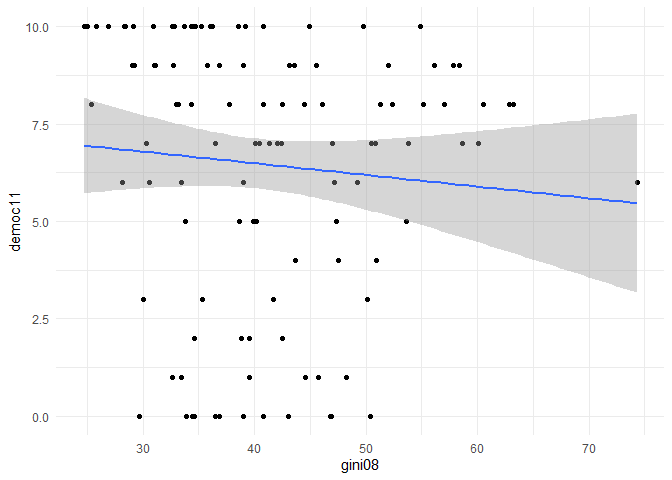

Nesse gráfico, podemos ver que a relação entre gini08 e democ11 é
ligeiramente negativa e o declive é baixo. Podemos também observar que o
erro, além de ser grande, é maior a medida que o valor de gini08 aumenta
também. Talvez isso tenha a ver com o fato que mais o nível de gini08
aumenta, menos há observações.

### Comparação entre gini 08 e fhrate04\_rev

**Gráfico de gini08 em relação a fhrate04\_rev:**

    ggplot(banco, aes(gini08, fhrate04_rev)) +
      geom_point(alpha = 0.1)+
      theme_minimal()

    ## Warning: Removed 45 rows containing missing values (geom_point).

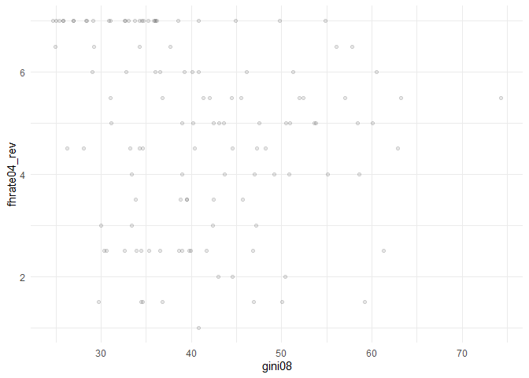

Nesse gráfico, conseguimos destacar que, de maneira geral, países mais
democráticos tem indícios de Gini mais fracos, ou seja, são menos
desiguais, e que países menos democráticos têm indícios de Gini mais
altos, ou seja, são mais desiguais. Porém, vemos que essa evolução
negativa não fica tão clara nesse gráfico como no precedente porque
muitos países são considerados mais democráticos (7, 6, 5) ou menos
democráticos (2-3) e têm indícios de Gini diversos.

**Teste de correlação entre gini 08 e fhrate04\_rev:**

    cor.test(banco$gini08, banco$fhrate04_rev)

    ## 
    ##  Pearson's product-moment correlation
    ## 
    ## data:  banco$gini08 and banco$fhrate04_rev
    ## t = -1.9869, df = 120, p-value = 0.04921
    ## alternative hypothesis: true correlation is not equal to 0
    ## 95 percent confidence interval:
    ##  -0.3452745300 -0.0007294745
    ## sample estimates:
    ##        cor 
    ## -0.1784673

O coeficiente de correlação entre o indício de Gini e fhrate04\_rev é
fraco e negativo (-0.1784673). Esse resultado é confiável porque o
p-value é menor do que 0.05, tem valor de 0.04921. Porém, seu valor é
muito próximo de 0.05, então, quase não é confiável. O intervalo de
confiança é pequeno, mas a correlação é fraca, então não poderemos ter
boas previsões com essa correlação.

Esse teste de correlação confirma o gráfico.

**Regressão Linear entre gini 08 e fhrate04\_rev:**

    regressao <- lm(fhrate04_rev ~ gini08, data = banco)
    summary(regressao)

    ## 
    ## Call:
    ## lm(formula = fhrate04_rev ~ gini08, data = banco)
    ## 
    ## Residuals:
    ##     Min      1Q  Median      3Q     Max 
    ## -3.8312 -1.3896  0.4312  1.6729  2.6199 
    ## 
    ## Coefficients:
    ##             Estimate Std. Error t value Pr(>|t|)    
    ## (Intercept)  6.13654    0.67419   9.102 2.35e-15 ***
    ## gini08      -0.03199    0.01610  -1.987   0.0492 *  
    ## ---
    ## Signif. codes:  0 '***' 0.001 '**' 0.01 '*' 0.05 '.' 0.1 ' ' 1
    ## 
    ## Residual standard error: 1.786 on 120 degrees of freedom
    ##   (45 observations deleted due to missingness)
    ## Multiple R-squared:  0.03185,    Adjusted R-squared:  0.02378 
    ## F-statistic: 3.948 on 1 and 120 DF,  p-value: 0.04921

O valor do Intercept, ou do alpha, não é significativo pelas mesmas
razões que nas regressões anteriores.

O estimate de gini08 nos indica que quando o indício de Gini sobe de um
ponto, o nível de democracia (fhrate04\_rev) diminui de 0.03199, o que é
pouco. O erro sobre esse valor é de 0.01610, ou seja é um terço do
estimate. Por essa razão, por que o erro é grande em relação ao
estimate, o t não é é pequeno -1.987. Enfim, esse estimate tem um
p-valor no limite de 0.0492, quase igual a 0.05.

O RMSE é grande: 1.786. Ou seja, se a gente fosse prever o nível de
democracia de um país a partir do seu indício de Gini, esse modelo teria
um erro médio de 1.786, o que é grande.

Enfim, o Multiple R-squared é baixo: 0.03185, ou seja, um pouco mais de
3%. Isso significa que a variação do nível de democracia é pouco
explicada pela variação no nível de produção de petróleo.

**Gráfico da regressão linear entre gini08 e fhrate04\_rev:**

    ggplot(banco, aes(gini08, fhrate04_rev)) +
      geom_point() +
      geom_smooth(method = "lm") +
      theme_minimal()

    ## `geom_smooth()` using formula 'y ~ x'

    ## Warning: Removed 45 rows containing non-finite values (stat_smooth).

    ## Warning: Removed 45 rows containing missing values (geom_point).

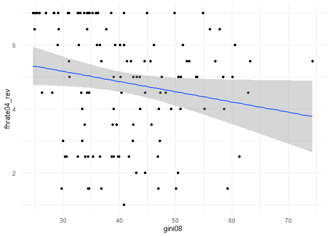

Nesse gráfico, podemos ver que a relação entre gini08 e fhrate04\_rev é
ligeiramente negativa e o declive é baixo. Podemos também observar que o
erro, além de ser grande, é maior a medida que o valor de gini08 aumenta
também. Talvez isso tenha a ver com o fato que mais o nível de gini08
aumenta, menos há observações.

### Comparação entre gini e fhrate08\_rev

**Gráfico de gini08 em relação a fhrate08\_rev:**

    ggplot(banco, aes(gini08, fhrate08_rev)) +
      geom_point(alpha = 0.1) +
      theme_minimal()

    ## Warning: Removed 46 rows containing missing values (geom_point).

Nesse gráfico, conseguimos destacar que, de maneira geral, países mais
democráticos tem indícios de Gini mais fracos, ou seja, são menos
desiguais, e que países menos democráticos têm indícios de Gini mais
altos, ou seja, são mais desiguais. Porém, vemos que essa evolução
negativa não fica tão clara nesse gráfico, como no precedente, porque
muitos países são considerados mais democráticos (8-12.5) ou menos
democráticos (3-7) e têm indícios de Gini diversos.

**Teste de correlação entre gini 08 e fhrate08\_rev:**

    cor.test(banco$gini08, banco$fhrate08_rev)

    ## 
    ##  Pearson's product-moment correlation
    ## 
    ## data:  banco$gini08 and banco$fhrate08_rev
    ## t = -1.7432, df = 119, p-value = 0.08387
    ## alternative hypothesis: true correlation is not equal to 0
    ## 95 percent confidence interval:
    ##  -0.32708386  0.02129614
    ## sample estimates:
    ##        cor 
    ## -0.1578002

O coeficiente de correlação entre o indício de Gini e fhrate08\_rev é
muito fraco e negativo (-0.1578002). Esse resultado não é confiável
porque o p-value é maior do que 0.05, tem valor de 0.08387 Além disso, o
intervalo de confiança contém zero. Com todos esses resultados,
concluimos que essa correlação é péssima, não podemos fazer previsões
com ela.

Esse teste de correlação confirma o gráfico.

**Regressão Linear entre gini08 e fhrate08\_rev:**

    regressao <- lm(fhrate08_rev ~ gini08, data = banco)
    summary(regressao)

    ## 
    ## Call:
    ## lm(formula = fhrate08_rev ~ gini08, data = banco)
    ## 
    ## Residuals:
    ##     Min      1Q  Median      3Q     Max 
    ## -7.9157 -2.5971  0.6712  3.4091  5.0961 
    ## 
    ## Coefficients:
    ##             Estimate Std. Error t value Pr(>|t|)    
    ## (Intercept)  9.97288    1.34188   7.432 1.79e-11 ***
    ## gini08      -0.05590    0.03207  -1.743   0.0839 .  
    ## ---
    ## Signif. codes:  0 '***' 0.001 '**' 0.01 '*' 0.05 '.' 0.1 ' ' 1
    ## 
    ## Residual standard error: 3.554 on 119 degrees of freedom
    ##   (46 observations deleted due to missingness)
    ## Multiple R-squared:  0.0249, Adjusted R-squared:  0.01671 
    ## F-statistic: 3.039 on 1 and 119 DF,  p-value: 0.08387

O valor do Intercept, ou do alpha, não é significativo pelas mesmas
razões que nas regressões anteriores.

O estimate de gini08 nos indica que quando o indício de Gini sobe de um
ponto, o nível de democracia (fhrate08\_rev) diminui de 0.05590, o que é
pouco. O erro sobre esse valor é de 0.03207, ou seja é mais da metade do
estimate. Por essa razão, por que o erro é grande em relação ao
estimate, o t é pequeno -1.743. Enfim, esse estimate tem um p-valor de
0.0839, maior do que 0.05.

O RMSE é gigante: 3.554. Ou seja, se a gente fosse prever o nível de
democracia de um país a partir do seu indício de Gini, esse modelo teria
um erro médio de 3.554, o que é gigante.

Enfim, o Multiple R-squared é baixo: 0.0249, ou seja, um pouco mais do
que 2%. Isso significa que a variação do nível de democracia é pouco
explicada pela variação no nível de produção de petróleo.

**Gráfico da regressão linear entre gini08 e fhrate08\_rev:**

    ggplot(banco, aes(gini08, fhrate08_rev)) +
      geom_point() +
      geom_smooth(method = "lm") +
      theme_minimal()

    ## `geom_smooth()` using formula 'y ~ x'

    ## Warning: Removed 46 rows containing non-finite values (stat_smooth).

    ## Warning: Removed 46 rows containing missing values (geom_point).

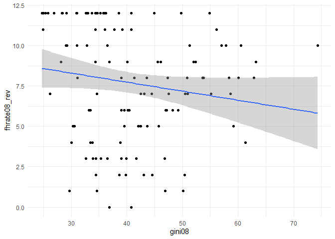

Nesse gráfico, podemos ver que a relação entre gini08 e fhrate08\_rev é
negativa e o declive é baixo. Podemos também observar que o erro, além
de ser grande, é maior a medida que o valor de gini08 aumenta também.
Talvez isso tenha a ver com o fato que mais o nível de gini08 aumenta,
menos há observações.

### Comparação entre gini 08 e polity

**Gráfico de gini08 em relação a polity:**

    ggplot(banco, aes(gini08, polity)) +
      geom_point(alpha = 0.1) +
      theme_minimal()

    ## Warning: Removed 52 rows containing missing values (geom_point).

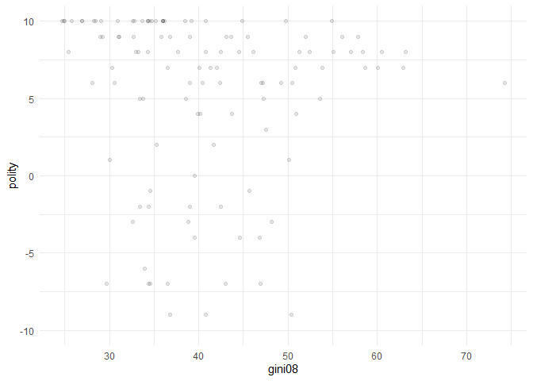
Esse gráfico não mostra nenhum padrão evidente. Assim, há muitas
democracias com valores muito diferentes do indício de Gini.

**Teste de correlação entre gini 08 e polity:**

    cor.test(banco$gini08, banco$polity)

    ## 
    ##  Pearson's product-moment correlation
    ## 
    ## data:  banco$gini08 and banco$polity
    ## t = -0.43417, df = 113, p-value = 0.665
    ## alternative hypothesis: true correlation is not equal to 0
    ## 95 percent confidence interval:
    ##  -0.2222590  0.1433725
    ## sample estimates:
    ##         cor 
    ## -0.04080936

O coeficiente de correlação entre o indício de Gini e fhrate08\_rev é
muito fraco e negativo (-0.04080936). Esse resultado não é confiável
porque o p-value é maior do que 0.05, tem um valor de 0.665. Além disso,
o intervalo de confiança contém zero. Com todos esses resultados,
concluimos que essa correlação é péssima, não podemos fazer previsões
com ela.

Esse teste de correlação confirma o gráfico.

**Regressão Linear entre gini08 e polity:**

    regressao <- lm(polity ~ gini08, data = banco)
    summary(regressao)

    ## 
    ## Call:
    ## lm(formula = polity ~ gini08, data = banco)
    ## 
    ## Residuals:
    ##     Min      1Q  Median      3Q     Max 
    ## -14.374  -1.300   2.364   4.087   5.040 
    ## 
    ## Coefficients:
    ##             Estimate Std. Error t value Pr(>|t|)   
    ## (Intercept)  6.21813    2.20594   2.819  0.00569 **
    ## gini08      -0.02292    0.05280  -0.434  0.66499   
    ## ---
    ## Signif. codes:  0 '***' 0.001 '**' 0.01 '*' 0.05 '.' 0.1 ' ' 1
    ## 
    ## Residual standard error: 5.535 on 113 degrees of freedom
    ##   (52 observations deleted due to missingness)
    ## Multiple R-squared:  0.001665,   Adjusted R-squared:  -0.007169 
    ## F-statistic: 0.1885 on 1 and 113 DF,  p-value: 0.665

O valor do Intercept, ou do alpha, não é significativo pelas mesmas
razões que nas regressões anteriores.

O estimate de gini08 nos indica que quando o indício de Gini sobe de um
ponto, o nível de democracia (polity) diminui de 0.02292, o que é muito
pouco. O erro sobre esse valor é de 0.05280, ou seja é maior do que o
estimate. Por essa razão, por que o erro é grande em relação ao
estimate, o t é muito pequeno -0.434. Enfim, esse estimate tem um
p-valor de 0.66499, maior do que 0.05.

O RMSE é gigante: 5.535. Ou seja, se a gente fosse prever o nível de
democracia de um país a partir do seu indício de Gini, esse modelo teria
um erro médio de 5.535, o que é gigante.

Enfim, o Multiple R-squared é muito muito baixo: 0.001665, nem 1%. Isso
significa que a variação do nível de democracia é pouco explicada pela
variação no nível de produção de petróleo.

Essa foi, sem dúvida, a pior regressão. Da mesma forma, foi o pior teste
de correlação foi entre gini08 e polity.

**Gráfico da regressão linear entre gini08 e polity:**

    ggplot(banco, aes(gini08, polity)) +
      geom_point() +
      geom_smooth(method = "lm") +
      theme_minimal()

    ## `geom_smooth()` using formula 'y ~ x'

    ## Warning: Removed 52 rows containing non-finite values (stat_smooth).

    ## Warning: Removed 52 rows containing missing values (geom_point).

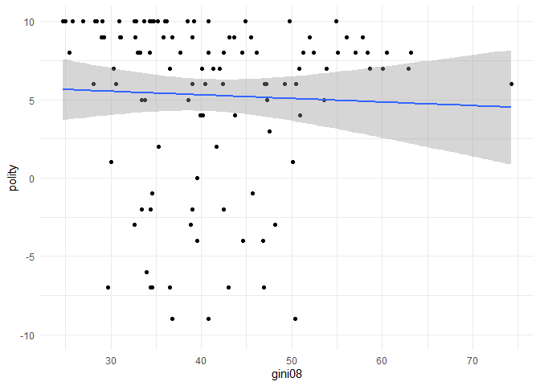

Nesse gráfico, podemos ver que a relação entre gini08 e fhrate08\_rev é
muito ligeiramente negativa e o declive é quase nulo. Podemos também
observar que o erro, além de ser grande, é maior a medida que o valor de
gini08 aumenta também. Talvez isso tenha a ver com o fato que mais o
nível de gini08 aumenta, menos há observações.

### Comparação entre os testes de correlação:

Podemos ver que nenhum teste de correlação deu certo. Assim, o “melhor”
teste de correlação é o primeiro com a variável dem\_score14
(-0.2192877), que, ainda é fraco. O outro teste de correlação indicou
alguma relação, mesmo se fraca, foi com a variável fhrate04\_rev
(-0.1784673). Todos os outros (democ11, fhrate08\_rev, polity) deram
resultados que indicam que não há relaçao entre o indício de Gini e o
nível de democracia. Ou seja, a diferença de renda nao permite fazer
previsões sobre o nível de democracia. Uma informação relevante que
podemos aprender desses testes é que, se existe uma relação entre o
indício de Gini e o nível de democracia, essa relação é negativa: quando
o indício de Gini aumenta, o nível de democracia baixa.

### Comparação entre as regressões:

Da mesma forma que com os testes de correlação, as regressões lineares
não foram muito conclusivas. Assim, os melhores modelos, que têm alguma
significância estatística, são aqueles com as variáveis fhrate04\_rev
(no limite) e dem\_score14. Porém, mesmo assim, não parecem ser bons
modelos. Os outros, com democ11, fhrate08\_rev e polity, tiveram
p-valores altos demais para considerá-los significativos.

Avalie a relação entre todas as medidas de democracia e crescimento econômico, utilizando a variável `gdppcap08`. Descreva graficamente esta variável, a relação entre as duas variáveis, meça a correlação entre elas e faça regressões lineares (interpretando em profundidade os resultados dos coeficientes e medidas de desempenho dos modelos). Enfatize as semelhanças e diferenças entre os resultados. Quais são suas conclusões?
------------------------------------------------------------------------------------------------------------------------------------------------------------------------------------------------------------------------------------------------------------------------------------------------------------------------------------------------------------------------------------------------------------------------------------------

**Gráfico da variável gdppcap08:**

    ggplot(banco, aes(gdppcap08)) +
      geom_boxplot() +
      theme_minimal()

    ## Warning: Removed 15 rows containing non-finite values (stat_boxplot).

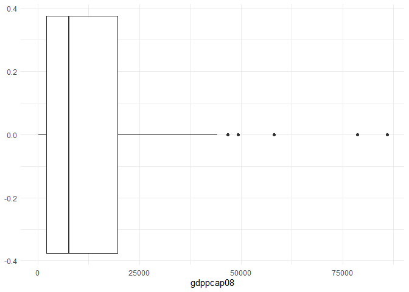

    ggplot(banco, aes(gdppcap08)) +
      geom_density() +
      theme_minimal()

    ## Warning: Removed 15 rows containing non-finite values (stat_density).

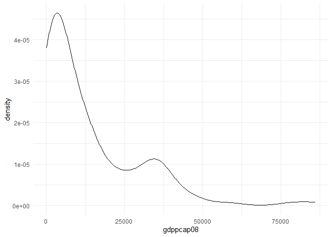

No gráfico de boxplot, podemos ver que os valores de PIB per capita dos
países são concentrados no início dos valores do PIB per capita (antes
de mais ou menos 20 000). Os dois primeiros quartis são os mais densos.
No gráfico de densidade, há um pico em menos de 10 000 e outro bem menor
em 30 000.

### Comparação entre gdppcap08 08 e dem\_score14

**Gráfico de gdppcap08 em relação a dem\_score14:**

    ggplot(banco, aes(gdppcap08, dem_score14)) +
      geom_point(alpha = 0.1) +
      theme_minimal()

    ## Warning: Removed 15 rows containing missing values (geom_point).

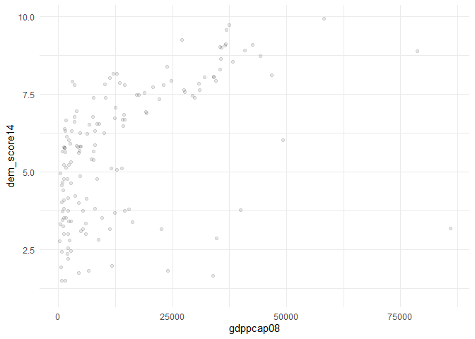

Nesse gráfico, conseguimos claramente ver uma evolução no sentido de
“países poucos democráticos com PIB per capita fraco” para “países mais
democráticos com PIB per capita maior”.

**Teste de correlação entre gdppcap08 e dem\_score14:**

    cor.test(banco$gdppcap08, banco$dem_score14)

    ## 
    ##  Pearson's product-moment correlation
    ## 
    ## data:  banco$gdppcap08 and banco$dem_score14
    ## t = 7.1713, df = 150, p-value = 3.159e-11
    ## alternative hypothesis: true correlation is not equal to 0
    ## 95 percent confidence interval:
    ##  0.3763618 0.6150148
    ## sample estimates:
    ##       cor 
    ## 0.5052872

O coeficiente de correlação entre as variáveis gdppcap08 e dem\_score14
é médio e positivo (0.5052872). Ou seja, quando o PIB per capita
aumenta, o nível de democracia também aumenta. Esse resultado é
confiável porque o p-value é menor do que 0.05, aliás, é muito pequeno,
tem um valor de 3.159e-11 O intervalo de confiança sendo pequeno (menos
de 0.3) e a correlação média, poderemos ter relativamente boas previsões
com essa correlação. Ou seja, poderemos estimar o nível de democracia de
um país a partir do PIB per capita com uma precisão correta.

Esse teste de correlação confirma o gráfico.

**Regressão Linear entre gdppcap08 e dem\_score14:**

    regressao <- lm(dem_score14 ~ gdppcap08, data = banco)
    summary(regressao)

    ## 
    ## Call:
    ## lm(formula = dem_score14 ~ gdppcap08, data = banco)
    ## 
    ## Residuals:
    ##     Min      1Q  Median      3Q     Max 
    ## -7.5428 -1.3420  0.6982  1.2843  3.0329 
    ## 
    ## Coefficients:
    ##              Estimate Std. Error t value Pr(>|t|)    
    ## (Intercept) 4.678e+00  2.017e-01  23.197  < 2e-16 ***
    ## gdppcap08   7.040e-05  9.817e-06   7.171 3.16e-11 ***
    ## ---
    ## Signif. codes:  0 '***' 0.001 '**' 0.01 '*' 0.05 '.' 0.1 ' ' 1
    ## 
    ## Residual standard error: 1.864 on 150 degrees of freedom
    ##   (15 observations deleted due to missingness)
    ## Multiple R-squared:  0.2553, Adjusted R-squared:  0.2504 
    ## F-statistic: 51.43 on 1 and 150 DF,  p-value: 3.159e-11

O valor do Intercept, ou do alpha, não é significativo pelas mesmas
razões que nas regressões anteriores.

O estimate de gdppcap08 nos indica que quando o PIB per capita sobe de
um ponto, o nível de democracia (dem\_score14) aumenta de 7.040e-05, o
que é igual a 7.04\*10^(-5). Esse valor parece ser pequeno, mas para
entendê-lo, precisamos olhar para os valores de gdppcap08. Assim,
gdppcap08 pega valores de 188 (Zimbabwe) até 85868 (Quatar). Então, uma
variação de 1000, por exemplo, daria uma variação no nível de democracia
de 7.04e-02 = 0.0704. Uma variação de 10 000 da um aumento de 0.704 no
nível de democracia.

O erro sobre esse valor é de 9.817e-06, ou seja, é menor do que o
estimate. Para um aumento de 1000 do PIB per capita, o erro é de
9.817e-03, o que é pouco em relação a 7.04e-2. Por essa razão, o t
parece ser razoavelmente grande: 7.171. Enfim, esse estimate tem um
p-valor de 3.16e-11, muito menor do que 0.05, então o modelo é
estatisticamente significativo.

O RMSE é grande: 1.864. Ou seja, se a gente fosse prever o nível de
democracia de um país a partir do seu PIB per capita, esse modelo teria
um erro médio de 1.864, o que muito é grande, sobretudo visto que o
estimate é tão pequeno.

Enfim, o Multiple R-squared é grande: 0.2553, ou seja mais de 25%. Isso
significa que a variação do nível de democracia é em parte explicada
pela variação no PIB per capita.

Esse modelo de regressão é um bom modelo. O melhor?

**Gráfico da regressão linear entre gdppcap08 e dem\_score14:**

    ggplot(banco, aes(gdppcap08, dem_score14)) +
      geom_point() +
      geom_smooth(method = "lm") +
      theme_minimal()

    ## `geom_smooth()` using formula 'y ~ x'

    ## Warning: Removed 15 rows containing non-finite values (stat_smooth).

    ## Warning: Removed 15 rows containing missing values (geom_point).

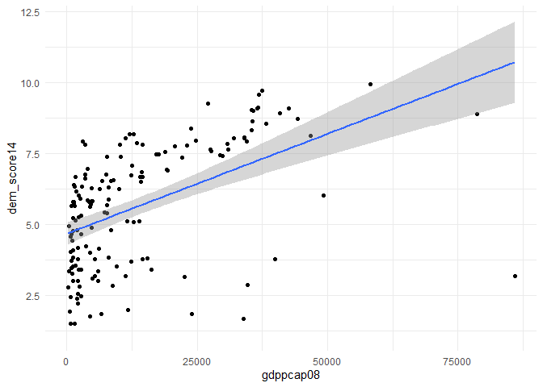

Podemos ver, nesse gráfico, que a relação entre gdppcap08 e dem\_score14
é positiva. Da mesma forma que com gini08, o erro aumenta a medida que
gdppcap08 aumenta, provavelmente por falta de observações.

### Comparação entre gdppcap08 08 e democ11

**Gráfico de gdppcap08 em relação a democ11:**

    ggplot(banco, aes(gdppcap08, democ11)) +
      geom_point(alpha = 0.1) +
      theme_minimal()

    ## Warning: Removed 25 rows containing missing values (geom_point).

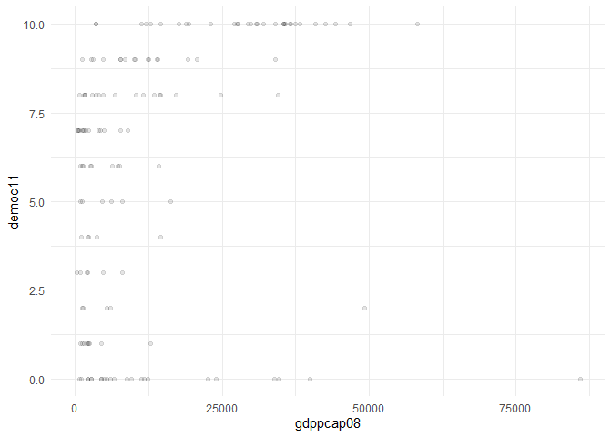

Nesse gráfico, conseguimos ver uma evolução fraca no sentido de “países
poucos democráticos com PIB per capita fraco” para “países mais
democráticos com PIB per capita maior”.Porém, essa evolução não ficou
muito clara porque há muitos países muito democráticos (com 10, ou perto
de 10) e muitos países absolutamente não democráticos (com 0, ou perto
de 0).

**Teste de correlação entre gdppcap08 e democ11:**

    cor.test(banco$gdppcap08, banco$democ11)

    ## 
    ##  Pearson's product-moment correlation
    ## 
    ## data:  banco$gdppcap08 and banco$democ11
    ## t = 3.6037, df = 140, p-value = 0.000435
    ## alternative hypothesis: true correlation is not equal to 0
    ## 95 percent confidence interval:
    ##  0.1330147 0.4351981
    ## sample estimates:
    ##      cor 
    ## 0.291358

O coeficiente de correlação entre as variáveis gdppcap08 e democ11 é
fraco e positivo (0.291358). Ou seja, quando o PIB per capita aumenta, o
nível de democracia aumenta um pouco. Esse resultado é confiável porque
o p-valor é menor do que 0.05, tem um valor de 0.000435. O intervalo de
confiança sendo pequeno (mais ou menos 0.3) e a correlação fraca, nao
poderemos ter boas previsões com essa correlação. Ou seja, não poderemos
estimar o nível de democracia de um país a partir do PIB per capita com
muita precisão.

Esse teste de correlação confirma o gráfico.

**Regressão Linear entre gdppcap08 e democ11:**

    regressao <- lm(democ11 ~ gdppcap08, data = banco)
    summary(regressao)

    ## 
    ## Call:
    ## lm(formula = democ11 ~ gdppcap08, data = banco)
    ## 
    ## Residuals:
    ##     Min      1Q  Median      3Q     Max 
    ## -11.258  -3.030   1.723   2.783   4.803 
    ## 
    ## Coefficients:
    ##              Estimate Std. Error t value Pr(>|t|)    
    ## (Intercept) 4.939e+00  4.026e-01  12.270  < 2e-16 ***
    ## gdppcap08   7.359e-05  2.042e-05   3.604 0.000435 ***
    ## ---
    ## Signif. codes:  0 '***' 0.001 '**' 0.01 '*' 0.05 '.' 0.1 ' ' 1
    ## 
    ## Residual standard error: 3.57 on 140 degrees of freedom
    ##   (25 observations deleted due to missingness)
    ## Multiple R-squared:  0.08489,    Adjusted R-squared:  0.07835 
    ## F-statistic: 12.99 on 1 and 140 DF,  p-value: 0.000435

O valor do Intercept, ou do alpha, não é significativo pelas mesmas
razões que nas regressões anteriores.

O estimate de gdppcap08 nos indica que quando o PIB per capita sobe de
um ponto, o nível de democracia (democ11) aumenta de 7.359e-05. Esse
valor parece ser pequeno, mas, pelas mesmas razões do que na regressão
anterior, é um valor grande.

O erro sobre esse valor é de 2.042e-05, ou seja corresponde a mais de um
terço do estimate. Por essa razão o t vale 3.604. Enfim, esse estimate
tem um p-valor de 0.000435, menor do que 0.05, então indicando uma
significância estatística.

O RMSE é grande: 3.57. Ou seja, se a gente fosse prever o nível de
democracia de um país a partir do seu PIB per capita, esse modelo teria
um erro médio de 3.57, o que é grande.

Enfim, o Multiple R-squared é muito baixo: 0.08489, menos de 9%. Isso
significa que a variação do nível de democracia é pouco explicada pela
variação no PIB per capita.

Feito a correlação, esse modelo de regressão linear é significativo, mas
não permite fazer boas previsões.

**Gráfico da regressão linear entre gdppcap08 e democ11:**

    ggplot(banco, aes(gdppcap08, democ11)) +
      geom_point() +
      geom_smooth(method = "lm") +
      theme_minimal()

    ## `geom_smooth()` using formula 'y ~ x'

    ## Warning: Removed 25 rows containing non-finite values (stat_smooth).

    ## Warning: Removed 25 rows containing missing values (geom_point).

Podemos ver, nesse gráfico, que a relação entre gdppcap08 e democ11 é
positiva. Da mesma forma que anteriormente, o erro aumenta a medida que
gdppcap08 aumenta, provavelmente por falta de observações.

### Comparação entre gdppcap08 08 e fhrate04\_rev

**Gráfico de gdppcap08 em relação a fhrate04\_rev:**

    ggplot(banco, aes(gdppcap08, fhrate04_rev)) +
      geom_point(alpha = 0.1) +
      theme_minimal()

    ## Warning: Removed 15 rows containing missing values (geom_point).

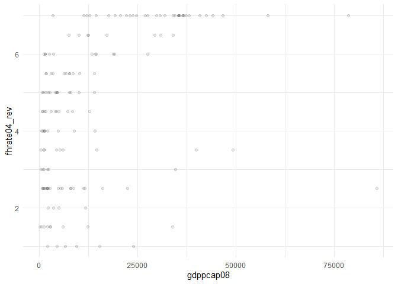

Nesse gráfico, conseguimos ver uma evolução no sentido de “países poucos
democráticos com PIB per capita fraco” para “países mais democráticos
com PIB per capita maior”.

**Teste de correlação entre gdppcap08 e fhrate04\_rev:**

    cor.test(banco$gdppcap08, banco$fhrate04_rev)

    ## 
    ##  Pearson's product-moment correlation
    ## 
    ## data:  banco$gdppcap08 and banco$fhrate04_rev
    ## t = 6.0129, df = 150, p-value = 1.331e-08
    ## alternative hypothesis: true correlation is not equal to 0
    ## 95 percent confidence interval:
    ##  0.3027442 0.5605748
    ## sample estimates:
    ##       cor 
    ## 0.4407043

O coeficiente de correlação entre as variáveis gdppcap08 e fhrate04\_rev
é médio e positivo (0.4407043). Ou seja, quando o PIB per capita
aumenta, o nível de democracia também aumenta. Esse resultado é
confiável porque o p-valor é menor do que 0.05, aliás, é muito pequeno,
tem um valor de 1.331e-08. O intervalo de confiança sendo pequeno (menos
de 0.3) e a correlação média, concluimos que poderemos ter relativamente
boas previsões com essa correlação. Ou seja, poderemos estimar o nível
de democracia de um país a partir do PIB per capita com uma precisão
correta.

Esse teste de correlação confirma o gráfico.

**Regressão Linear entre gdppcap08 e fhrate04\_rev:**

    regressao <- lm(fhrate04_rev ~ gdppcap08, data = banco)
    summary(regressao)

    ## 
    ## Call:
    ## lm(formula = fhrate04_rev ~ gdppcap08, data = banco)
    ## 
    ## Residuals:
    ##     Min      1Q  Median      3Q     Max 
    ## -6.0897 -1.4154  0.5914  1.2481  2.9773 
    ## 
    ## Coefficients:
    ##              Estimate Std. Error t value Pr(>|t|)    
    ## (Intercept) 3.828e+00  1.894e-01  20.210  < 2e-16 ***
    ## gdppcap08   5.545e-05  9.222e-06   6.013 1.33e-08 ***
    ## ---
    ## Signif. codes:  0 '***' 0.001 '**' 0.01 '*' 0.05 '.' 0.1 ' ' 1
    ## 
    ## Residual standard error: 1.751 on 150 degrees of freedom
    ##   (15 observations deleted due to missingness)
    ## Multiple R-squared:  0.1942, Adjusted R-squared:  0.1888 
    ## F-statistic: 36.16 on 1 and 150 DF,  p-value: 1.331e-08

O valor do Intercept, ou do alpha, não é significativo pelas mesmas
razões que nas regressões anteriores.

O estimate de gdppcap08 nos indica que quando o PIB per capita sobe de
um ponto, o nível de democracia (fhrate04\_rev) aumenta de 5.545e-05.
Esse valor parece ser pequeno, mas, pelas mesmas razões do que nas
regressões anterior, é um valor grande.

O erro sobre esse valor é de 9.222e-06, ou seja é pequeno en relação ao
estimate. Por essa razão o t vale 6.013. Enfim, esse estimate tem um
p-valor de 1.33e-08, muito menor do que 0.05, então indicando uma
significância estatística.

O RMSE é grande: 1.751. Ou seja, se a gente fosse prever o nível de
democracia de um país a partir do seu PIB per capita, esse modelo teria
um erro médio de 1.751, o que é grande.

Enfim, o Multiple R-squared é significativo: 0.1942, ou seja, quase 20%.
Isso significa que a variação do nível de democracia é em parte
explicada pela variação no PIB per capita.

**Gráfico da regressão linear entre gdppcap08 e fhrate04\_rev:**

    ggplot(banco, aes(gdppcap08, fhrate04_rev)) +
      geom_point() +
      geom_smooth(method = "lm") +
      theme_minimal()

    ## `geom_smooth()` using formula 'y ~ x'

    ## Warning: Removed 15 rows containing non-finite values (stat_smooth).

    ## Warning: Removed 15 rows containing missing values (geom_point).

Podemos ver, nesse gráfico, que a relação entre gdppcap08 e
fhrate04\_rev é positiva. Da mesma forma que anteriormente, o erro
aumenta a medida que gdppcap08 aumenta, provavelmente por falta de
observações.

### Comparação entre gdppcap08 08 e fhrate08\_rev

**Gráfico de gdppcap08 em relação a fhrate08\_rev:**

    ggplot(banco, aes(gdppcap08, fhrate08_rev)) +
      geom_point(alpha = 0.1) +
      theme_minimal()

    ## Warning: Removed 16 rows containing missing values (geom_point).

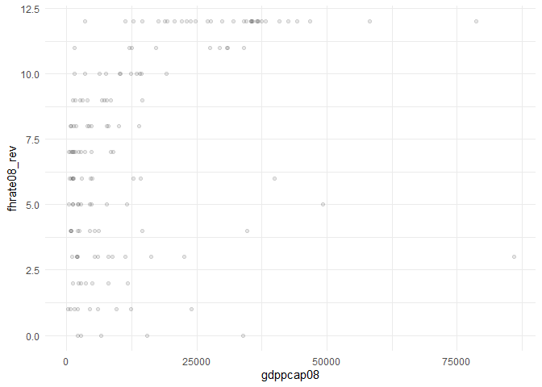

Nesse gráfico, conseguimos ver uma evolução no sentido de “países poucos
democráticos com PIB per capita fraco” para “países mais democráticos
com PIB per capita maior”.

**Teste de correlação entre gdppcap08 e fhrate08\_rev:**

    cor.test(banco$gdppcap08, banco$fhrate08_rev)

    ## 
    ##  Pearson's product-moment correlation
    ## 
    ## data:  banco$gdppcap08 and banco$fhrate08_rev
    ## t = 6.0508, df = 149, p-value = 1.115e-08
    ## alternative hypothesis: true correlation is not equal to 0
    ## 95 percent confidence interval:
    ##  0.3061176 0.5638582
    ## sample estimates:
    ##     cor 
    ## 0.44413

O coeficiente de correlação entre as variáveis gdppcap08 e fhrate08\_rev
é médio e positivo (0.44413). Ou seja, quando o PIB per capita aumenta,
o nível de democracia também aumenta. Esse resultado é confiável porque
o p-value é menor do que 0.05, aliás, é muito pequeno, tem um valor de
1.115e-08. O intervalo de confiança sendo pequeno (menos de 0.3) e a
correlação média, concluimos que poderemos ter relativamente boas
previsões com esse modelo. Ou seja, poderemos estimar o nível de
democracia de um país a partir do PIB per capita com uma precisão
correta.

Esse teste de correlação confirma o gráfico.

Esse teste de correlação entre as variáveis gdppcap08 e fhrate08\_rev
deu melhores resultados do que o teste de correlação entre as variáveis
gdppcap08 e fhrate04\_rev.

**Regressão Linear entre gdppcap08 e fhrate08\_rev:**

    regressao <- lm(fhrate08_rev ~ gdppcap08, data = banco)
    summary(regressao)

    ## 
    ## Call:
    ## lm(formula = fhrate08_rev ~ gdppcap08, data = banco)
    ## 
    ## Residuals:
    ##     Min      1Q  Median      3Q     Max 
    ## -12.124  -2.345   1.164   2.510   5.918 
    ## 
    ## Coefficients:
    ##              Estimate Std. Error t value Pr(>|t|)    
    ## (Intercept) 5.698e+00  3.739e-01  15.237  < 2e-16 ***
    ## gdppcap08   1.098e-04  1.814e-05   6.051 1.11e-08 ***
    ## ---
    ## Signif. codes:  0 '***' 0.001 '**' 0.01 '*' 0.05 '.' 0.1 ' ' 1
    ## 
    ## Residual standard error: 3.438 on 149 degrees of freedom
    ##   (16 observations deleted due to missingness)
    ## Multiple R-squared:  0.1973, Adjusted R-squared:  0.1919 
    ## F-statistic: 36.61 on 1 and 149 DF,  p-value: 1.115e-08

O valor do Intercept, ou do alpha, não é significativo pelas mesmas
razões que nas regressões anteriores.

O estimate de gdppcap08 nos indica que quando o PIB per capita sobe de
um ponto, o nível de democracia (fhrate08\_rev) aumenta de 1.098e-04.
Esse valor parece ser pequeno, mas, pelas mesmas razões do que nas
regressões anterior, é um valor grande.

O erro sobre esse valor é de 1.814e-05, ou seja é pequeno en relação ao
estimate. Por essa razão o t vale 6.051. Enfim, esse estimate tem um
p-valor de 1.11e-08, muito menor do que 0.05, então indicando uma
significância estatística.

O RMSE é grande: 3.438. Ou seja, se a gente fosse prever o nível de
democracia de um país a partir do seu PIB per capita, esse modelo teria
um erro médio de 3.438, o que é grande.

Enfim, o Multiple R-squared é significante: 0.1973, ou seja, quase 20%.
Isso significa que a variação do nível de democracia é em parte
explicada pela variação no PIB per capita.

**Gráfico da regressão linear entre gdppcap08 e fhrate08\_rev:**

    ggplot(banco, aes(fhrate08_rev, gdppcap08)) +
      geom_point() +
      geom_smooth(method = "lm") +
      theme_minimal()

    ## `geom_smooth()` using formula 'y ~ x'

    ## Warning: Removed 16 rows containing non-finite values (stat_smooth).

    ## Warning: Removed 16 rows containing missing values (geom_point).

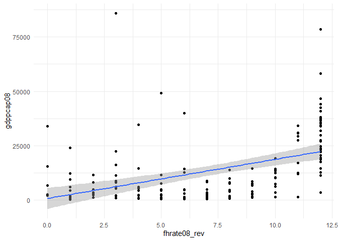

Podemos ver, nesse gráfico, que a relação entre gdppcap08 e
fhrate08\_rev é positiva. Da mesma forma que anteriormente, o erro
aumenta a medida que gdppcap08 aumenta, provavelmente por falta de
observações.

Os resultados dessa regressão são parecidos com a anterior porque as
variáveis fhrate08\_rev e fhrate04\_rev são muito parecidas.

### Comparação entre gdppcap08 08 e polity

**Gráfico de gdppcap08 em relação a polity:**

    ggplot(banco, aes(gdppcap08, polity)) +
      geom_point(alpha = 0.1) +
      theme_minimal()

    ## Warning: Removed 25 rows containing missing values (geom_point).

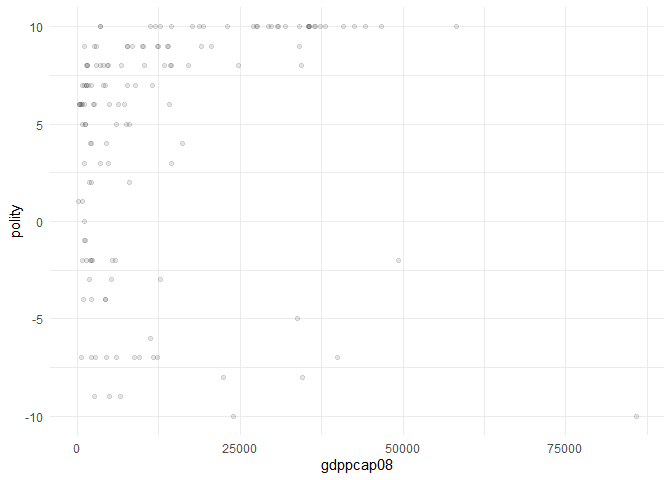

Nesse gráfico, podemos ver que os países mais democráticos tendem a ter
PIB per capita mais altos e conseguimos ver uma evolução fraca nesse
sentido.

**Teste de correlação entre gdppcap08 e polity:**

    cor.test(banco$gdppcap08, banco$polity)

    ## 
    ##  Pearson's product-moment correlation
    ## 
    ## data:  banco$gdppcap08 and banco$polity
    ## t = 2.0332, df = 140, p-value = 0.04392
    ## alternative hypothesis: true correlation is not equal to 0
    ## 95 percent confidence interval:
    ##  0.004758504 0.325013386
    ## sample estimates:
    ##      cor 
    ## 0.169353

O coeficiente de correlação entre as variáveis gdppcap08 e polity é
fraco e positivo (0.169353). Ou seja, quando o PIB per capita aumenta, o
nível de democracia aumenta um pouco. Esse resultado é confiável porque
o p-valor é menor do que 0.05, tem um valor de 0.04392. O intervalo de
confiança sendo pequeno (mais ou menos 0.3) e a correlação fraca, não
poderemos ter boas previsões com essa correlação. Ou seja, não poderemos
estimar o nível de democracia de um país a partir do PIB per capita com
muita precisão.

Esse teste de correlação confirma o gráfico.

**Regressão Linear entre gdppcap08 e polity:**

    regressao <- lm(polity ~ gdppcap08, data = banco)
    summary(regressao)

    ## 
    ## Call:
    ## lm(formula = polity ~ gdppcap08, data = banco)
    ## 
    ## Residuals:
    ##     Min      1Q  Median      3Q     Max 
    ## -19.426  -4.207   2.847   4.332   6.378 
    ## 
    ## Coefficients:
    ##              Estimate Std. Error t value Pr(>|t|)    
    ## (Intercept) 3.375e+00  6.833e-01   4.940  2.2e-06 ***
    ## gdppcap08   7.047e-05  3.466e-05   2.033   0.0439 *  
    ## ---
    ## Signif. codes:  0 '***' 0.001 '**' 0.01 '*' 0.05 '.' 0.1 ' ' 1
    ## 
    ## Residual standard error: 6.059 on 140 degrees of freedom
    ##   (25 observations deleted due to missingness)
    ## Multiple R-squared:  0.02868,    Adjusted R-squared:  0.02174 
    ## F-statistic: 4.134 on 1 and 140 DF,  p-value: 0.04392

O valor do Intercept, ou do alpha, não é significativo pelas mesmas
razões que nas regressões anteriores.

O estimate de gdppcap08 nos indica que quando o PIB per capita sobe de
um ponto, o nível de democracia (polity) aumenta de 7.047e-05. Esse
valor parece ser pequeno, mas, pelas mesmas razões do que nas regressões
anterior, é um valor grande.

O erro sobre esse valor é de 3.466e-05, ou seja é a metade do estimate.
Por essa razão o t vale 2.033. Enfim, esse estimate tem um p-valor de
0.0439, um pouco menor do que 0.05, então indicando uma significância
estatística.

O RMSE é grande: 6.059. Ou seja, se a gente fosse prever o nível de
democracia de um país a partir do seu PIB per capita, esse modelo teria
um erro médio de 3.438, o que é grande.

Enfim, o Multiple R-squared é baixo: 0.02868, ou seja, menos de 3%. Isso
significa que a variação do nível de democracia é pouco explicada pela
variação no PIB per capita.

**Gráfico da regressão linear entre gdppcap08 e polity:**

    ggplot(banco, aes(gdppcap08, polity)) +
      geom_point() +
      geom_smooth(method = "lm") +
      theme_minimal()

    ## `geom_smooth()` using formula 'y ~ x'

    ## Warning: Removed 25 rows containing non-finite values (stat_smooth).

    ## Warning: Removed 25 rows containing missing values (geom_point).

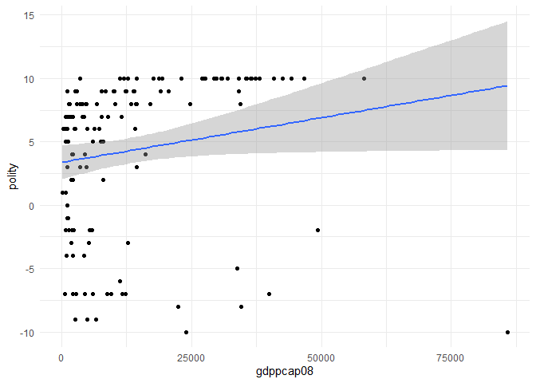

Podemos ver, nesse gráfico, que a relação entre gdppcap08 e polity é
positiva, porém fraca. Da mesma forma que anteriormente, o erro aumenta
a medida que gdppcap08 aumenta, provavelmente por falta de observações.

### Comparação entre os testes de correlação:

Os melhores resultados foram achados com as variavéis:
dem\_score14,fhrate04\_rev, fhrate08\_rev. Os piores resultados foram
achados com as variavéis: democ11, polity.

De maneira geral, podemos dizer que se existe uma relação entre o PIB
per capita e o nível de democracia, essa relação é positiva. Ou seja,
quando o PIB per capita aumenta, o nível de democracia aumenta também.

### Comparação entre os modelos de regressão:

Todos os modelos funcionaram, porém com graus diferentes de
significância. Assim, os modelos com dem\_score14, fhrate04\_rev e
fhrate08\_rev são bons, com um p-valor pequeno, e um r quadrado de quase
20%. Porém, os modelos com democ11 e politiy são fracos, p-valor maiores
e r quadrados muito baixo, assim, não permitem boas previsões.

### Avalie a relação entre todas as medidas de democracia e produção de petróleo, utilizando a variável `oil`. Descreva graficamente esta variável, a relação entre as duas variáveis, meça a correlação entre elas e faça regressões lineares (interpretando em profundidade os resultados dos coeficientes e medidas de desempenho dos modelos). Enfatize as semelhanças e diferenças entre os resultados. Quais são suas conclusões?

**Gráfico da variável oil:**

    ggplot(banco, aes(oil)) +
      geom_boxplot() +
      theme_minimal()

    ## Warning: Removed 2 rows containing non-finite values (stat_boxplot).

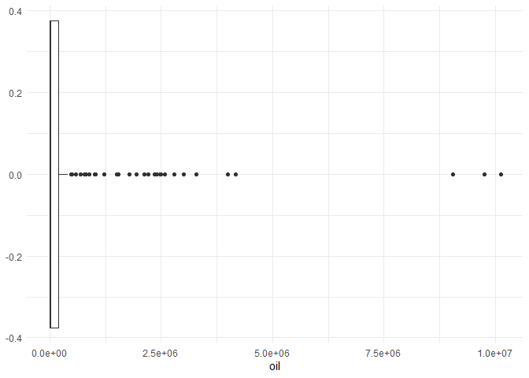

    ggplot(banco, aes(oil)) +
      geom_density() +
      theme_minimal()

    ## Warning: Removed 2 rows containing non-finite values (stat_density).

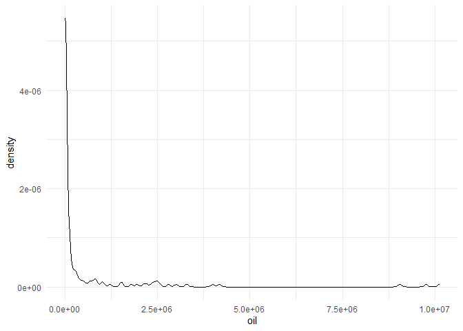

Nesse gráfico, podemos ver que existem muitos países, uma grande
maioria, que produzem pouquíssimo (ou até nada) petróleo. Assim, há um
pico gigante no início do gráfico, nos valores fracos de petróleo.
Observamos também que há poucos países que produzem uma quantidade
razoável de petróleo, e poucos que produzem muito petróleo.

### Comparação entre oil e dem\_score14

**Gráfico de oil em relação a dem\_score14:**

    ggplot(banco, aes(oil, dem_score14)) +
      geom_point(alpha = 0.1) +
      theme_minimal()

    ## Warning: Removed 2 rows containing missing values (geom_point).

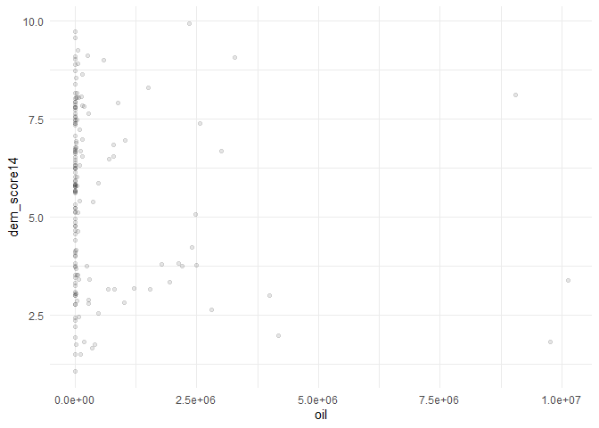

Podemos ver, no gráfico, que países com pouca produção de petróleo são
geralmente mais democráticos, porém, há uma quantidade relevante de
países que não são muito democráticos e que também produzem pouco
petróleo. Sobre o resto do gráfico, não conseguimos perceber um padrão
claro de correlação entre as duas variáveis.

**Teste de correlação entre oil e dem\_score14:**

    cor.test(banco$oil, banco$dem_score14)

    ## 
    ##  Pearson's product-moment correlation
    ## 
    ## data:  banco$oil and banco$dem_score14
    ## t = -1.6344, df = 163, p-value = 0.1041
    ## alternative hypothesis: true correlation is not equal to 0
    ## 95 percent confidence interval:
    ##  -0.27443572  0.02631799
    ## sample estimates:
    ##        cor 
    ## -0.1269762

O coeficiente de correlação entre as variáveis oil e dem\_score14 é
muito fraco e negativo (-0.1269762). Esse resultado não é confiavel
porque o p-valor é maior do que 0.05, tem valor de 0.1041 Além disso, o
intervalo de confiança contém zero. Com todos esses resultados,
concluimos que essa correlação é péssima, não podemos fazer previsões
com ela.

Esse teste de correlação confirma o gráfico.

**Regressão Linear entre oil e dem\_score14:**

    regressao <- lm(dem_score14 ~ oil, data = banco)
    summary(regressao)

    ## 
    ## Call:
    ## lm(formula = dem_score14 ~ oil, data = banco)
    ## 
    ## Residuals:
    ##    Min     1Q Median     3Q    Max 
    ## -4.574 -1.934  0.144  1.797  4.718 
    ## 
    ## Coefficients:
    ##               Estimate Std. Error t value Pr(>|t|)    
    ## (Intercept)  5.654e+00  1.795e-01  31.503   <2e-16 ***
    ## oil         -1.881e-07  1.151e-07  -1.634    0.104    
    ## ---
    ## Signif. codes:  0 '***' 0.001 '**' 0.01 '*' 0.05 '.' 0.1 ' ' 1
    ## 
    ## Residual standard error: 2.177 on 163 degrees of freedom
    ##   (2 observations deleted due to missingness)
    ## Multiple R-squared:  0.01612,    Adjusted R-squared:  0.01009 
    ## F-statistic: 2.671 on 1 and 163 DF,  p-value: 0.1041

O valor do Intercept, ou do alpha, não é significativo pelas mesmas
razões que nas regressões anteriores.

O estimate de oil nos indica que quando a produção de petróleo sobe de
um ponto, o nível de democracia (dem\_score14) diminui de -1.881e-07.
Esse valor parece ser pequeno, mas, pelas mesmas razões do que nas
regressões anterior, é um valor grande. Assim, os valores de produção de
petróleo vão de 0 a 10120000 (Russia).

O erro sobre esse valor é de 1.151e-07 , ou seja muito alto em relação
ao estimate. Por essa razão o t é pequeno e vale -1.634. Enfim, esse
estimate tem um p-valor de 0.104, maior do que 0.05, então indicando uma
não significância estatística.

O RMSE é grande: 2.177. Ou seja, se a gente fosse prever o nível de
democracia de um país a partir da sua produção de petróleo, esse modelo
teria um erro médio de 2.177, o que é grande.

Enfim, o Multiple R-squared é baixo: 0.01612, ou seja, menos de 2%. Isso
significa que a variação do nível de democracia é pouco explicada pela
variação da sua produção de petróleo.

**Gráfico da regressão linear entre oil e dem\_score14:**

    ggplot(banco, aes(dem_score14, oil)) +
      geom_point() +
      geom_smooth(method = "lm") +
      theme_minimal()

    ## `geom_smooth()` using formula 'y ~ x'

    ## Warning: Removed 2 rows containing non-finite values (stat_smooth).

    ## Warning: Removed 2 rows containing missing values (geom_point).

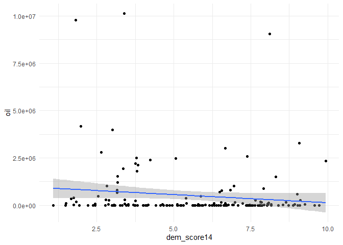

Podemos ver, nesse gráfico, uma relação ligeiramente negativa entre oil
e dem\_score14.

### Comparação entre oil e democ11

**Gráfico de oil em relação a democ11:**

    ggplot(banco, aes(oil, democ11)) +
      geom_point(alpha = 0.1) +
      theme_minimal()

    ## Warning: Removed 23 rows containing missing values (geom_point).

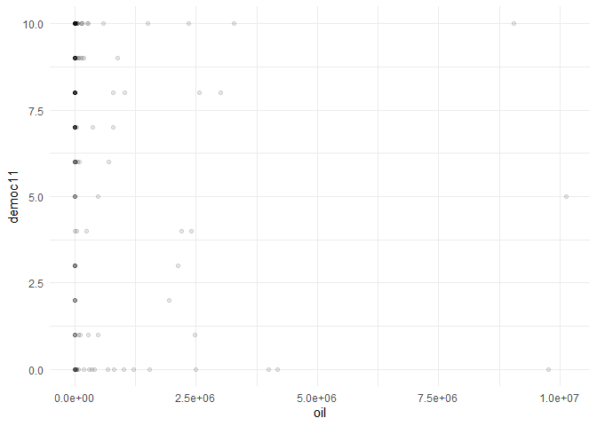

Podemos ver, no gráfico, que países com pouca produção de petróleo são
geralmente mais democráticos, porém, há uma quantidade relevante de
países que não são muito democráticos e que também produzem pouco
petróleo. Sobre o resto do gráfico, não conseguimos perceber um padrão
claro de correlação entre as duas variáveis.

**Teste de correlação entre oil e democ11:**

    cor.test(banco$oil, banco$democ11)

    ## 
    ##  Pearson's product-moment correlation
    ## 
    ## data:  banco$oil and banco$democ11
    ## t = -1.718, df = 142, p-value = 0.08798
    ## alternative hypothesis: true correlation is not equal to 0
    ## 95 percent confidence interval:
    ##  -0.29928445  0.02138076
    ## sample estimates:
    ##        cor 
    ## -0.1426942

O coeficiente de correlação entre as variáveis oil e democ11 é fraco e
negativo (-0.1426942). Esse resultado não é confiável porque o p-valor é
maior do que 0.05, tem valor de 0.08798. Além disso, o intervalo de
confiança contém zero. Com todos esses resultados, concluimos que essa
correlação é péssima, não podemos fazer previsões com ela.

Esse teste de correlação confirma o gráfico.

**Regressão Linear entre oil e democ11:**

    regressao <- lm(democ11 ~ oil, data = banco)
    summary(regressao)

    ## 
    ## Call:
    ## lm(formula = democ11 ~ oil, data = banco)
    ## 
    ## Residuals:
    ##     Min      1Q  Median      3Q     Max 
    ## -6.1387 -3.2230  0.8616  2.8893  6.9421 
    ## 
    ## Coefficients:
    ##               Estimate Std. Error t value Pr(>|t|)    
    ## (Intercept)  6.139e+00  3.259e-01  18.837   <2e-16 ***
    ## oil         -3.402e-07  1.980e-07  -1.718    0.088 .  
    ## ---
    ## Signif. codes:  0 '***' 0.001 '**' 0.01 '*' 0.05 '.' 0.1 ' ' 1
    ## 
    ## Residual standard error: 3.685 on 142 degrees of freedom
    ##   (23 observations deleted due to missingness)
    ## Multiple R-squared:  0.02036,    Adjusted R-squared:  0.01346 
    ## F-statistic: 2.951 on 1 and 142 DF,  p-value: 0.08798

O valor do Intercept, ou do alpha, não é significativo pelas mesmas
razões que nas regressões anteriores.

O estimate de oil nos indica que quando a produção de petróleo sobe de
um ponto, o nível de democracia (democ11) diminui de -3.402e-07. Esse
valor parece ser pequeno, mas, pelas mesmas razões do que nas regressões
anterior, é um valor grande. Assim, os valores de produção de petróleo
vao de 0 a 10120000 (Russia).

O erro sobre esse valor é de 1.980e-07, ou seja muito alto em relação ao
estimate, é mais da metade. Por essa razão o t vale -1.718. Enfim, esse
estimate tem um p-valor de 0.088, maior do que 0.05, então indicando uma
não significância estatística.

O RMSE é grande: 3.685. Ou seja, se a gente fosse prever o nível de
democracia de um país a partir da sua produção de petróleo, esse modelo
teria um erro médio de 3.685, o que é grande.

Enfim, o Multiple R-squared é baixo: 0.02036, ou seja, mais ou menos de
2%. Isso significa que a variação do nível de democracia é pouco
explicada pela variação da sua produção de petróleo.

**Gráfico da regressão linear entre oil e democ11:**

    ggplot(banco, aes(democ11, oil)) +
      geom_point() +
      geom_smooth(method = "lm") +
      theme_minimal()

    ## `geom_smooth()` using formula 'y ~ x'

    ## Warning: Removed 23 rows containing non-finite values (stat_smooth).

    ## Warning: Removed 23 rows containing missing values (geom_point).

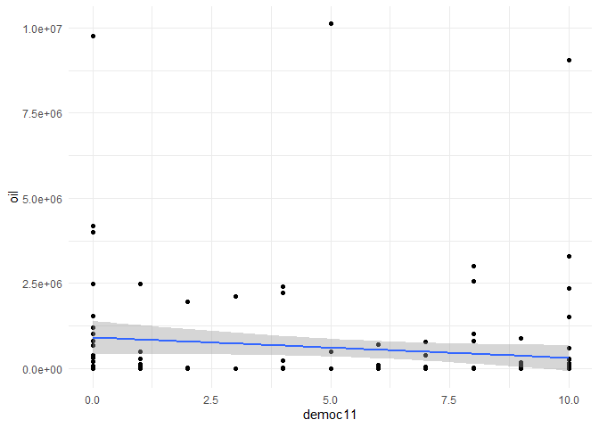

Podemos ver, nesse gráfico, uma relação ligeiramente negativa entre oil
e democ11.

### Comparação entre oil e fhrate04\_rev

**Gráfico de oil em relação a fhrate04\_rev:**

    ggplot(banco, aes(oil, fhrate04_rev)) +
      geom_point(alpha = 0.1) +
      theme_minimal()

    ## Warning: Removed 15 rows containing missing values (geom_point).

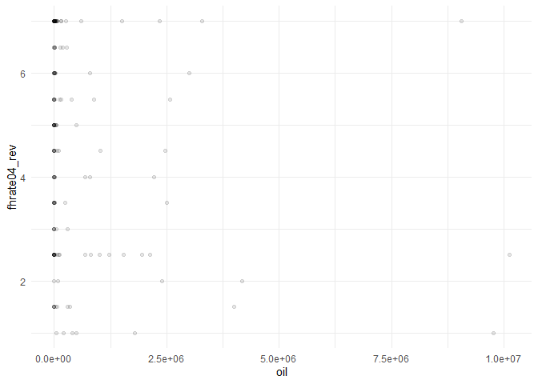

Podemos ver, no gráfico, que países com pouca produção de petróleo são
geralmente mais democráticos, porém, há uma quantidade relevante de
países que não são muito democráticos e que também produzem pouco
petróleo. Sobre o resto do gráfico, não conseguimos perceber um padrão
claro de correlação entre as duas variáveis.

**Teste de correlação entre oil e fhrate04\_rev:**

    cor.test(banco$oil, banco$fhrate04_rev)

    ## 
    ##  Pearson's product-moment correlation
    ## 
    ## data:  banco$oil and banco$fhrate04_rev
    ## t = -1.9244, df = 150, p-value = 0.0562
    ## alternative hypothesis: true correlation is not equal to 0
    ## 95 percent confidence interval:
    ##  -0.306837012  0.004083069
    ## sample estimates:
    ##        cor 
    ## -0.1552185

O coeficiente de correlação entre as variáveis oil e fhrate04\_rev é
fraco e negativo (-0.1552185). Esse resultado não é confiável porque o
p-value é maior do que 0.05, tem valor de 0.0562. Além disso, o
intervalo de confiança contém zero. Com todos esses resultados,
concluimos que essa correlação é péssima, não podemos fazer previsões
com ela.

Esse teste de correlação confirma o gráfico.

**Regressão Linear entre oil e fhrate04\_rev:**

    regressao <- lm(fhrate04_rev ~ oil, data = banco)
    summary(regressao)

    ## 
    ## Call:
    ## lm(formula = fhrate04_rev ~ oil, data = banco)
    ## 
    ## Residuals:
    ##     Min      1Q  Median      3Q     Max 
    ## -3.6658 -1.7613  0.3246  1.8334  4.1268 
    ## 
    ## Coefficients:
    ##               Estimate Std. Error t value Pr(>|t|)    
    ## (Intercept)  4.675e+00  1.663e-01  28.109   <2e-16 ***
    ## oil         -1.990e-07  1.034e-07  -1.924   0.0562 .  
    ## ---
    ## Signif. codes:  0 '***' 0.001 '**' 0.01 '*' 0.05 '.' 0.1 ' ' 1
    ## 
    ## Residual standard error: 1.934 on 150 degrees of freedom
    ##   (15 observations deleted due to missingness)
    ## Multiple R-squared:  0.02409,    Adjusted R-squared:  0.01759 
    ## F-statistic: 3.703 on 1 and 150 DF,  p-value: 0.0562

O valor do Intercept, ou do alpha, não é significativo pelas mesmas
razões que nas regressões anteriores.

O estimate de oil nos indica que quando a produção de petróleo sobe de
um ponto, o nível de democracia (fhrate04\_rev) diminui de -1.990e-07.
Esse valor parece ser pequeno, mas, pelas mesmas razões do que nas
regressões anterior, é um valor grande.

O erro sobre esse valor é de 1.034e-07, ou seja muito alto em relação ao
estimate, é mais da metade. Por essa razão o t vale -1.924. Enfim, esse
estimate tem um p-valor de 0.0562, maior do que 0.05, então indicando
uma não significância estatística.

O RMSE é grande: 1.934. Ou seja, se a gente fosse prever o nível de
democracia de um país a partir da sua produção de petróleo, esse modelo
teria um erro médio de 1.934, o que é grande.

Enfim, o Multiple R-squared é baixo: 0.02409, ou seja, menos de 3%. Isso
significa que a variação do nível de democracia é pouco explicada pela
variação da sua produção de petróleo.

**Gráfico da regressão linear entre oil e fhrate04\_rev:**

    ggplot(banco, aes(fhrate04_rev, oil)) +
      geom_point() +
      geom_smooth(method = "lm") +
      theme_minimal()

    ## `geom_smooth()` using formula 'y ~ x'

    ## Warning: Removed 15 rows containing non-finite values (stat_smooth).

    ## Warning: Removed 15 rows containing missing values (geom_point).

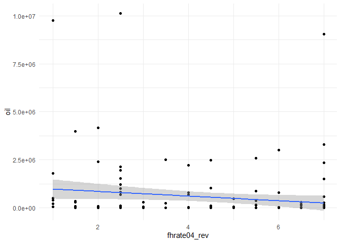

Podemos ver, nesse gráfico, uma relação ligeiramente negativa entre oil
e fhrate04\_rev.

### Comparação entre oil e fhrate08\_rev

**Gráfico de oil em relação a fhrate08\_rev:**

    ggplot(banco, aes(oil, fhrate08_rev)) +
      geom_point(alpha = 0.1) +
      theme_minimal()

    ## Warning: Removed 16 rows containing missing values (geom_point).

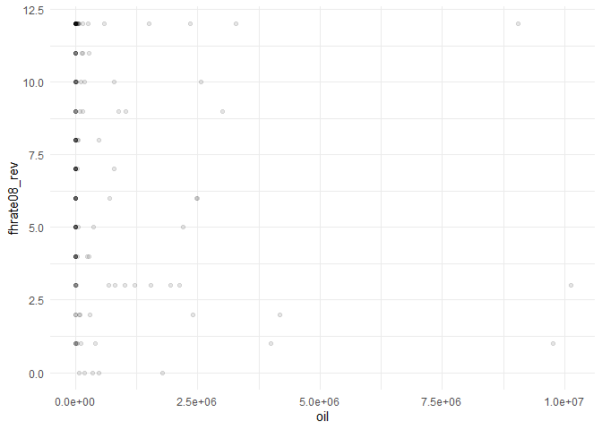

Podemos ver, no gráfico, que países com pouca produção de petróleo são
geralmente mais democráticos, porém, há uma quantidade relevante de
países que não são muito democráticos e que também produzem pouco
petróleo. Sobre o resto do gráfico, não conseguimos perceber um padrão
claro de correlação entre as duas variáveis.

**Teste de correlação entre oil e fhrate08\_rev:**

    cor.test(banco$oil, banco$fhrate08_rev)

    ## 
    ##  Pearson's product-moment correlation
    ## 
    ## data:  banco$oil and banco$fhrate08_rev
    ## t = -1.8779, df = 149, p-value = 0.06235
    ## alternative hypothesis: true correlation is not equal to 0
    ## 95 percent confidence interval:
    ##  -0.304387817  0.007867529
    ## sample estimates:
    ##       cor 
    ## -0.152052

O coeficiente de correlação entre as variáveis oil e fhrate08\_rev é
fraco e negativo (-0.152052). Esse resultado não é confiável porque o
p-valor é maior do que 0.05, tem valor de 0.06235. Além disso, o
intervalo de confiança contém zero. Com todos esses resultados,
concluimos que essa correlação é péssima, não podemos fazer previsões
com ela.

Esse teste de correlação confirma o gráfico.

**Regressão Linear entre oil e fhrate08\_rev:**

    regressao <- lm(fhrate08_rev ~ oil, data = banco)
    summary(regressao)

    ## 
    ## Call:
    ## lm(formula = fhrate08_rev ~ oil, data = banco)
    ## 
    ## Residuals:
    ##     Min      1Q  Median      3Q     Max 
    ## -7.3506 -3.3777 -0.3643  3.6243  8.0856 
    ## 
    ## Coefficients:
    ##               Estimate Std. Error t value Pr(>|t|)    
    ## (Intercept)  7.378e+00  3.286e-01  22.449   <2e-16 ***
    ## oil         -3.824e-07  2.037e-07  -1.878   0.0624 .  
    ## ---
    ## Signif. codes:  0 '***' 0.001 '**' 0.01 '*' 0.05 '.' 0.1 ' ' 1
    ## 
    ## Residual standard error: 3.808 on 149 degrees of freedom
    ##   (16 observations deleted due to missingness)
    ## Multiple R-squared:  0.02312,    Adjusted R-squared:  0.01656 
    ## F-statistic: 3.526 on 1 and 149 DF,  p-value: 0.06235

O valor do Intercept, ou do alpha, não é significativo pelas mesmas
razões que nas regressões anteriores.

O estimate de oil nos indica que quando a produção de petróleo sobe de
um ponto, o nível de democracia (fhrate08\_rev) diminui de 3.824e-07.
Esse valor parece ser pequeno, mas, pelas mesmas razões do que nas
regressões anterior, é um valor grande.

O erro sobre esse valor é de 2.037e-07, ou seja muito alto em relação ao
estimate, é mais da metade. Por essa razão o t vale -1.878. Enfim, esse
estimate tem um p-valor de 0.0624, maior do que 0.05, então indicando
uma não significância estatística.

O RMSE é grande: 3.808. Ou seja, se a gente fosse prever o nível de
democracia de um país a partir da sua produção de petróleo, esse modelo
teria um erro médio de 3.808, o que é grande.

Enfim, o Multiple R-squared é baixo: 0.02312, ou seja, menos de 3%. Isso
significa que a variação do nível de democracia é pouco explicada pela
variação da sua produção de petróleo.

**Gráfico da regressão linear entre oil e fhrate08\_rev:**

    ggplot(banco, aes(fhrate08_rev, oil)) +
      geom_point() +
      geom_smooth(method = "lm") +
      theme_minimal()

    ## `geom_smooth()` using formula 'y ~ x'

    ## Warning: Removed 16 rows containing non-finite values (stat_smooth).

    ## Warning: Removed 16 rows containing missing values (geom_point).

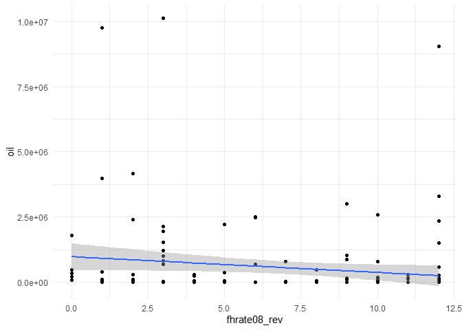

Podemos ver, nesse gráfico, uma relação ligeiramente negativa entre oil
e fhrate08\_rev.

### Comparação entre oil e polity

**Gráfico de oil em relação a polity:**

    ggplot(banco, aes(oil, polity)) +
      geom_point(alpha = 0.1) +
      theme_minimal()

    ## Warning: Removed 23 rows containing missing values (geom_point).

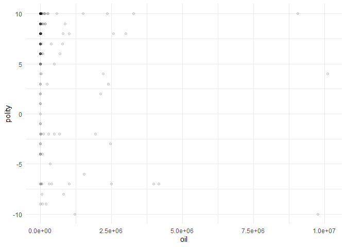

Podemos ver, no gráfico, que há muitos países com pouca produção de
petróleo e muito democráticos. Porém, há uma quantidade relevante de
países que não são muito democráticos e que também produzem pouco
petróleo. Sobre o resto do gráfico, não conseguimos perceber um padrão
claro de correlação entre as duas variáveis.

**Teste de correlação entre oil e polity:**

    cor.test(banco$oil, banco$polity)

    ## 
    ##  Pearson's product-moment correlation
    ## 
    ## data:  banco$oil and banco$polity
    ## t = -2.195, df = 142, p-value = 0.02979
    ## alternative hypothesis: true correlation is not equal to 0
    ## 95 percent confidence interval:
    ##  -0.33480603 -0.01811182
    ## sample estimates:
    ##        cor 
    ## -0.1811511

O coeficiente de correlação entre as variáveis oil e polity é fraco e
negativo (-0.1811511). Ou seja, quando o nível de produção de petróleo
aumenta, o nível de democracia aumenta um pouco. Esse resultado é
confiável porque o p-valor é menor do que 0.05, tem um valor de 0.02979
Apesar do intervalo de confiança ser pequeno (menos de 0.2), a
correlação é fraca, então não poderemos ter boas previsões com essa
correlação. Ou seja, não poderemos estimar o nível de democracia de um
país a partir da produção de petróleo com muita precisão.

Esse teste de correlação confirma o gráfico.

**Regressão Linear entre oil e polity:**

    regressao <- lm(polity ~ oil, data = banco)
    summary(regressao)

    ## 
    ## Call:
    ## lm(formula = polity ~ oil, data = banco)
    ## 
    ## Residuals:
    ##     Min      1Q  Median      3Q     Max 
    ## -13.890  -4.906   2.248   4.505  11.681 
    ## 
    ## Coefficients:
    ##               Estimate Std. Error t value Pr(>|t|)    
    ## (Intercept)  4.752e+00  5.327e-01   8.922 2.09e-15 ***
    ## oil         -7.105e-07  3.237e-07  -2.195   0.0298 *  
    ## ---
    ## Signif. codes:  0 '***' 0.001 '**' 0.01 '*' 0.05 '.' 0.1 ' ' 1
    ## 
    ## Residual standard error: 6.024 on 142 degrees of freedom
    ##   (23 observations deleted due to missingness)
    ## Multiple R-squared:  0.03282,    Adjusted R-squared:  0.026 
    ## F-statistic: 4.818 on 1 and 142 DF,  p-value: 0.02979

O valor do Intercept, ou do alpha, não é significativo pelas mesmas
razões que nas regressões anteriores.

O estimate de oil nos indica que quando a produção de petróleo sobe de
um ponto, o nível de democracia (polity) diminui de 7.105e-07. Esse
valor parece ser pequeno, mas, pelas mesmas razões do que nas regressões
anterior, é um valor grande.

O erro sobre esse valor é de 3.237e-07, ou seja muito alto em relação ao
estimate, é quase a metade. Por essa razão o t vale -2.195 Enfim, esse
estimate tem um p-valor de 0.0298, menor do que 0.05, então indicando
uma significância estatística.

O RMSE é grande: 6.024. Ou seja, se a gente fosse prever o nível de
democracia de um país a partir da sua produção de petróleo, esse modelo
teria um erro médio de 6.024, o que é grande.

Enfim, o Multiple R-squared é baixo: 0.03282, ou seja, mais ou menos de
3%. Isso significa que a variação do nível de democracia é pouco
explicada pela variação da sua produção de petróleo.

**Gráfico da regressão linear entre oil e polity:**

    ggplot(banco, aes(polity, oil)) +
      geom_point() +
      geom_smooth(method = "lm") +
      theme_minimal()

    ## `geom_smooth()` using formula 'y ~ x'

    ## Warning: Removed 23 rows containing non-finite values (stat_smooth).

    ## Warning: Removed 23 rows containing missing values (geom_point).

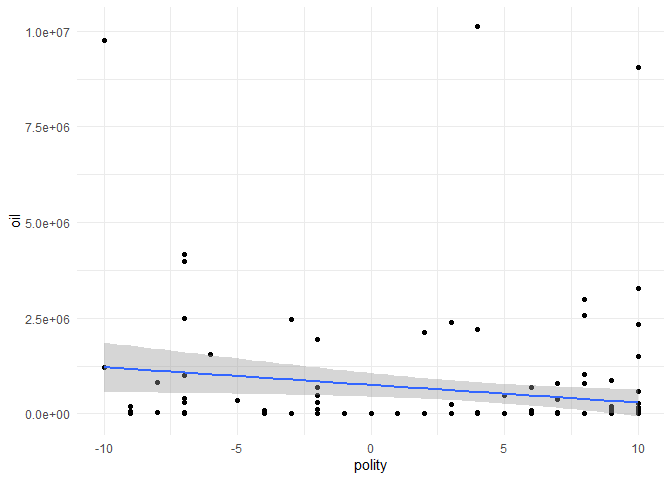

Podemos ver, nesse gráfico, uma relação ligeiramente negativa entre oil
e polity.

### Comparaçoes dos testes de correlação:

O único teste de correlação que teve um p-valor menor do que 0.05 foi o
teste de correlação entre as variáveis oil e polity. Porém, mesmo assim,
a correlação, se existe, é fraca. Todos os outros tiveram um p-valor
maior do que 0.05

### Comparaçao das regressões:

Nenhuma regressão deu resultados estatisticamente significativos. A
única que se aproximou de uma significância estatística foi a última
(oil e polity) com um p-valor correto. Porém, o RMSE é muito alto para
poder utilizar esse modelo e o Multiple R-squared é muito pequeno de
qualquer forma…

Avalie a relação entre crescimento econômico e produção de petróleo. Descreva a relação entre as duas variáveis, meça a correlação entre elas e faça regressões lineares (interpretando em profundidade os resultados dos coeficientes e medidas de desempenho dos modelos). Enfatize as semelhanças e diferenças entre os resultados. Quais são suas conclusões?
-----------------------------------------------------------------------------------------------------------------------------------------------------------------------------------------------------------------------------------------------------------------------------------------------------------------------------------------------------------------

### Comparação entre as variáveis gdppcap08 e oil:

Para avaliar a relação entre essas duas variáveis, eu vou considerar que
a produção de petróleo causa do desenvolvimento econômico, e não o
contrário. Ou seja, oil vai ser minha variável independente, x, e
gdppcap08 será minha variável dependente, y.

Assim, podemos considerar que um país que descobre grandes fontes de
petróleo vai acelerar seu desenvolvimento econômico pela fonte de renda
extra que representa esse óleo. Da mesma forma, vai aumentar o PIB per
capita dos seus habitante.

Poderiamos ter considerado uma relação inversa, mas acho mais dificil de
sustentá-la teoricamente. Por exemplo: quando o PIB per capita aumenta,
aumenta também a capacidade de empreendendorismo de um país, e assim a
possibilidade de achar e explorar fontes de óleo, e, então, aumenta a
produção de petróleo.

**Gráfico em pontos de oil e gdppcap08:**

    ggplot(banco, aes(oil, gdppcap08)) +
      geom_point(alpha = 0.1) +
      theme_minimal()

    ## Warning: Removed 16 rows containing missing values (geom_point).

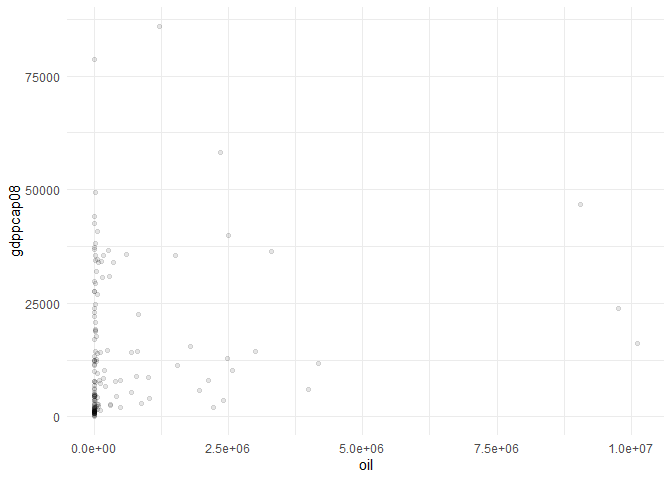

Podemos ver que os pontos se concentram na parte esquerda baixa. Isso
significaria que quando a produção de petróleo é baixa, o PIB per capita
é baixo também.O resto do gráfico não parece muito significativo, talvez
por falta de observações.

**Teste de correlação entre as variáveis gdppcap08 e oil:**

    cor.test(banco$oil, banco$gdppcap08)

    ## 
    ##  Pearson's product-moment correlation
    ## 
    ## data:  banco$oil and banco$gdppcap08
    ## t = 2.3051, df = 149, p-value = 0.02254
    ## alternative hypothesis: true correlation is not equal to 0
    ## 95 percent confidence interval:
    ##  0.02661893 0.33534756
    ## sample estimates:
    ##       cor 
    ## 0.1855584

O coeficiente de correlação entre as variáveis oil e polity é fraco e
positivo (0.1855584). Ou seja, quando o nível de produção de petróleo
aumenta, o PIB per capita aumenta um pouco. Esse resultado é confiável
porque o p-valor é menor do que 0.05, tem um valor de 0.02254. Apesar do
intervalo de confiança ser pequeno (menos de 0.01), a correlação é
fraca, então não poderemos ter boas previsões com essa correlação. Ou
seja, não poderemos estimar o PIB per capita de um país a partir da
produção de petróleo com muita precisão.

**Regressão Linear entre oil e gdppcap08:**

    regressao <- lm(gdppcap08 ~ oil, data = banco)
    summary(regressao)

    ## 
    ## Call:
    ## lm(formula = gdppcap08 ~ oil, data = banco)
    ## 
    ## Residuals:
    ##    Min     1Q Median     3Q    Max 
    ## -15541 -10735  -6347   6549  70967 
    ## 
    ## Coefficients:
    ##              Estimate Std. Error t value Pr(>|t|)    
    ## (Intercept) 1.262e+04  1.319e+03   9.566   <2e-16 ***
    ## oil         1.884e-03  8.173e-04   2.305   0.0225 *  
    ## ---
    ## Signif. codes:  0 '***' 0.001 '**' 0.01 '*' 0.05 '.' 0.1 ' ' 1
    ## 
    ## Residual standard error: 15280 on 149 degrees of freedom
    ##   (16 observations deleted due to missingness)
    ## Multiple R-squared:  0.03443,    Adjusted R-squared:  0.02795 
    ## F-statistic: 5.313 on 1 and 149 DF,  p-value: 0.02254

O valor do Intercept, ou do alpha, não é significativo pelas mesmas
razões que nas regressões anteriores.

O estimate de oil nos indica que quando a produção de petróleo sobe de
um ponto, o PIB per capita (gdppcap08) diminui de 1.884e-03.

O erro sobre esse valor é de 8.173e-04, ou seja muito alto em relação ao
estimate, é quase a metade. Por essa razão o t vale 2.305. Enfim, esse
estimate tem um p-valor de 0.0225, menor do que 0.05, então indicando
uma significância estatística.

O RMSE é grande: 15280. Ou seja, se a gente fosse prever o PIB per
capita de um país a partir da sua produção de petróleo, esse modelo
teria um erro médio de 15280, o que é grande.

Enfim, o Multiple R-squared é baixo: 0.03443, ou seja, um pouco mais de
3%. Isso significa que a variação do PIB per capita de um país é pouco
explicada pela variação da sua produção de petróleo.

**Gráfico da regressão linear entre oil e gdppcap08:**

    ggplot(banco, aes(oil, gdppcap08)) +
      geom_point() +
      geom_smooth(method = "lm") +
      theme_minimal()

    ## `geom_smooth()` using formula 'y ~ x'

    ## Warning: Removed 16 rows containing non-finite values (stat_smooth).

    ## Warning: Removed 16 rows containing missing values (geom_point).

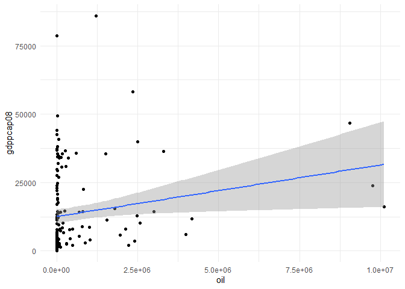

Podemos ver, nesse gráfico, que a relação entre o PIB per capita é
ligeiramente positiva com um erro que aumenta a medida que a variável
oil aumenta, provavelmente por falta de observações.

A partir das suas conclusões sobre a relação entre democracia, economia e produção de petróleo, quais considerações são possíveis fazer sobre a relação CAUSAL entre estas variáveis? Lembre dos 4 “hurdles” do livro *Fundamentals of Political Science Research*
------------------------------------------------------------------------------------------------------------------------------------------------------------------------------------------------------------------------------------------------------------------

### Desigualdade (x = gini08) e Democracia (y)

**1. Existe uma argumentação razoável para X causar Y?**

Sim. Sabemos que desigualdade impede a camada mais pobre de participar
politicamente, e então de lutar pelos seus direitos. Podemos supor que,
por isso, a desigualdade impede o crescimento democrático.

**2. Podemos descartar a chance de Y causar X?**

Não. A democracia é um regime onde, teoricamente, todos são iguais
perante a lei e todos podem participar politicamente à escolha dos seus
representantes. Então, todas as camadas “inferiores” (e as vezes
superiores) da população podem lutar por uma melhor repartição das
riquezas do país.

**3. Existe covariação entre X e Y?**

Temos pouca evidência estatistica que existe uma covariaçao entre X e Y.
Talvez seria interessante refazer esses testes e regressões no sentido
inverso (democracia –&gt; desigualdade).

### Desenvolvimento econômico (x) e Democracia (y)

**1. Existe uma argumentação razoável para X causar Y?**

Sim. Essa é uma teoria classica na ciência política: o desenvolvimento
econômico traz com ele a democracia. Assim, o desenvolvimento é oriundo
de um sistema comercial capitalista que transmite também valores
democráticos. A tese é que é mais fácil fazer comércio com democracias,
então, países democráticos, além de incentivar o desenvolvimento
econômico, vão também incentivar os valores democráticos.

Além disso, o desenvolvimento econômico, ao nível micro, faz com que as
pessoas têm mais tempo para se consagrar à política e assim a para lutar
para melhorias democráticas.

**2. Podemos descartar a chance de Y causar X?**

Não, o inverso é inteiramente possível. O aumento da democracia faz que
com a população possa escolher os representantes que prometem melhorar
suas condições de vida econômica.

Sinceramente, é provável que sejam fenômenos que se alimentam um e
outro. Da mesma forma que com o ovo ou a galinha, não sabemos qual
surgiu primeiro.

**3. Existe covariação entre X e Y?** Sim, os resultados dos testes de
correlação e das regressões foram conclusivos nesse sentido. Sobretudo
com as variáveis dem\_score14, fhrate04\_rev e fhrate08\_rev.

### Produção de petróleo (x) e Democracia (y)

**1. Existe uma argumentação razoável para X causar Y?** Sim. Quando a
produção de petróleo de um país aumenta, sua fonte de renda aumenta e
assim, o desenvolvimento econômico aumenta. Voltamos então para a
relação entre desenvolvimento econômico e democracia.

**2. Podemos descartar a chance de Y causar X?** Nao. Quando o nível de
democracia um país aumenta, as oportunidades comerciais desse país
também aumentam, e assim, suas capacidades para aumentar sua produção de
petróleo.

**3. Existe covariação entre X e Y?** Pelo visto, essa relação não é
muito evidente. Conseguimos obter alguma significância estatística com
uma variável de democracia, apenas, porém, os resultados foram pouco
conclusivos.

### Produção de petróleo (x) e desenvolvimento econômico (y)

**1. Existe uma argumentação razoável para X causar Y?** Sim, podemos
considerar que um país que descobre grandes fontes de petróleo vai
acelerar seu desenvolvimento econômico pela fonte de renda extra que
representa esse óleo. Da mesma forma, vai aumentar o PIB per capita dos
seus habitante.

**2. Podemos descartar a chance de Y causar X?**

Não, porque poderíamos considerar que quando o PIB per capita aumenta,
aumenta também a capacidade de empreendendorismo de um país, e assim a
possibilidade de achar e explorar fontes de óleo, e, então, aumenta a
produção de petróleo.

**3. Existe covariação entre X e Y?** Os resultados que obtivemos foram
pouco conclusivos.

**Observações:** Seria interessante de refazer esses testes a partir do
banco de dados do V-Dem que nos permite escolher o tipo de definição de
democracia que queremos estudar: mínima, máxima, personalizada…

Poderiamos também detalhar os testes, separando os países em regiões
geográficas, ou em grupos correspondendo a influências internacionais
particulares.

Sobre todas a relações que fizemos aqui, seria interessante refazer os
testes no sentido contrário, inverter o x e o y. Assim, teoricamente,
nós conseguimos argumentar nesse sentido.

Sobre o 4to hurdle, podemos ver que a variável oil poderia ter
influenciado o densenvolvimento econômico e o nível de democracia.
Porém, não foi o caso. Mas isso não impede que outra variável faça isso.
Assim, as variáveis correspondendo ao desenvolvimento econômico que
analisamos aqui são muito limitadas. Poderiamos refazer os testes
levando em conta os desenvolvimentos de setores particulares da economia
(primário, segundário, terciário), ou levando em conta as revoluções
tecnológicas (terceira, quarta). Além disso, poderiamos analisar o nível
de democracia e o desenvolvimento em função da pressão e das ajudas
internacionais.
