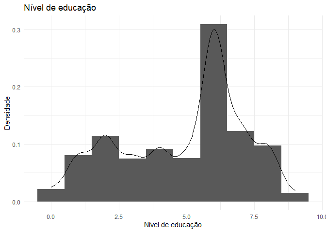
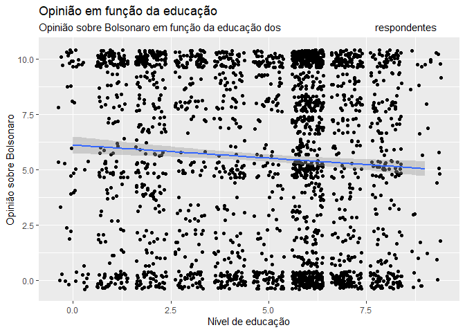

Exercicio 6
================
Carolina Gabriela Dolléans

### Neste exercício usaremos o banco de dados do ESEB 2018. Para maiores detalhes sobre o survey, ver neste [link](https://www.cesop.unicamp.br/por/eseb). O questionário da pesquisa de 2018 está [aqui](https://www.cesop.unicamp.br/vw/1IMr0S64wNQ_MDA_91ea3_/quest_04622.pdf) e pode ser consultado para ter maiores detalhes sobre as variáveis.

### O banco de dados está disponível no site do CESOP para usuários cadastrados. Para facilitar o acesso, deixei o banco de dados dispónivel no seguinte endereço: <https://github.com/MartinsRodrigo/Analise-de-dados/raw/master/04622.sav>

### Baixe o banco de dados pelo R

### O banco foi feito em SPSS e está em formato SAV. Carregue-o

``` r
setwd("C:\\Users\\Caro\\Desktop\\Mestrado CP\\Analise de dados\\Exercicios\\Exercicio 6")

url <- "https://github.com/MartinsRodrigo/Analise-de-dados/raw/master/04622.sav"

download.file(url, "ESEB_2018.sav", mode = "wb")

library(haven)

banco <- read_sav("ESEB_2018.sav")
```

### Utilize as funções para observar o banco de dados

``` r
library(tidyverse)
```

    ## -- Attaching packages ------------------------------ tidyverse 1.3.0 --

    ## v ggplot2 3.3.1     v purrr   0.3.4
    ## v tibble  3.0.1     v dplyr   1.0.0
    ## v tidyr   1.1.0     v stringr 1.4.0
    ## v readr   1.3.1     v forcats 0.5.0

    ## -- Conflicts --------------------------------- tidyverse_conflicts() --
    ## x dplyr::filter() masks stats::filter()
    ## x dplyr::lag()    masks stats::lag()

glimpse(banco) head(banco) tail(banco) summary(banco) str(banco)

### A variável Q1607 indica uma nota de 0 a 10 ao candidato Jair Bolsonaro. Valores acima de 10 representam respostas não uteis para nossa pesquisa. Represente graficamente esta variável apenas com os valores válidos e descreva o resultado.\*OBS: transforme esta variável para númerica com a função `as.numeric()`.

``` r
banco_filtrado <- banco %>%
  filter(Q1607 < 11)
```

**Gráfico de densidade e histogramas da variável Q1607:**

``` r
ggplot(banco_filtrado, aes(as.numeric(Q1607), ..density..)) +
  geom_histogram(bins = 15) +
  geom_density() +
  theme_minimal()+
  labs (title = "Opinião sobre Jair Bolsonaro", 
        x = "Opinião sobre Bolsonaro",
        y = "Densidade")
```

<!-- --> Aqui,
podemos ver que a maioria das notas atribuidas à Jair Bolsonaro são
extremas: ou 0 ou 10. Ou seja, a opinião sobre Jair Bolsonaro é muito
polarizada. Podemos ver que tem sensivelmente mais 10 do que 0.
Conseguimos distinguir também uma quantidade significativa de 5.
Percebemos também que há mais 2-3 do que 7-8.

### Vamos procurar entender o que está associado à aprovação deste candidato. Primeiro, vamos observar a idade dos respondentes com a variável D1A\_ID. Represente esta variável graficamente.

**Gráfico em violino da variável D1A\_ID:**

``` r
ggplot(banco_filtrado, aes(x = "", y = D1A_ID)) + 
  geom_violin(draw_quantiles = c(0.25, 0.5, 0.75)) +
  theme_minimal() +
  labs (title = "Idade dos respondentes", 
        x = "Densidade",
        y = "Idade dos respondentes")
```

<!-- -->

Aqui, podemos ver que a população brasileira é, no geral, jovem. Metade
das população tem menos de 40 anos. Tem muitos mais jovens do que
idosos. Vemos também que metade da população tem entre 27 e 52 anos
(mais ou menos).

### Teste a associação entre a nota dada a Jair Bolsonaro e idade do respondente, explicando o resultado.

Para fazer estudar a relação entre idade e opinião sobre Bolsonaro, eu
escolhi considerar que a idade causava a nota. Ou seja, D1AD\_ID é minha
variável independente, x; e Q1607 é minha variável dependente, y.

**Gráfico de Q1607 em relação a D1A\_ID:**

``` r
ggplot(banco_filtrado, aes(D1A_ID, as.numeric(Q1607))) +
  geom_point(alpha = 0.1) +
  theme_minimal() +
  labs (title = "Opinião em função da idade",
        subtitle = "Opinião sobre Bolsonaro em função da idade dos                                  respondentes", 
        x = "Idade dos respondentes",
        y = "Opinião sobre Bolsonaro")
```

<!-- -->

Quando observamos esse gráfico, entendemos que é difícil observar uma
relação entre idade e nota atribuida à Jair Bolsonaro. Assim, as pessoas
que atribuiram 0 têm de 16 anos a 65-70 e quem atribuiu 10 é apenas
ligeiramente mais velho: de 20 anos até mais de 75. Então, se existe uma
relação entre idade de nota atribuida à Jair Bolsonaro, ela é fraca e
positiva.

**Teste de correlação entre Q1607 e D1A\_ID:**

``` r
cor.test(banco_filtrado$Q1607, banco_filtrado$D1A_ID)
```

    ## 
    ##  Pearson's product-moment correlation
    ## 
    ## data:  banco_filtrado$Q1607 and banco_filtrado$D1A_ID
    ## t = 4.8628, df = 2324, p-value = 1.235e-06
    ## alternative hypothesis: true correlation is not equal to 0
    ## 95 percent confidence interval:
    ##  0.0599630 0.1404313
    ## sample estimates:
    ##       cor 
    ## 0.1003613

O coeficiente de correlação entre Q1607 e D1A\_ID é fraco e positivo
(0.1003613). Esse resultado é confiável porque o p-valor é menor do que
0.05, tem valor de 1.235e-06. Enfim, o intervalo de confiança é pequeno
(menos de 0.1) e não contem o 0. Esse teste confirma o gráfico: existe
uma correlação fraca entre Q1607 e D1A\_ID.

### Faça uma regressão linear mostrando em que medida a idade do respondente explica a avaliação do candidato Jair Bolsonaro. Interprete o resultado.

**Regressão entre D1A\_ID e Q1607:**

``` r
regressao <- lm(as.numeric(Q1607) ~ D1A_ID, data = banco_filtrado)
summary(regressao)
```

    ## 
    ## Call:
    ## lm(formula = as.numeric(Q1607) ~ D1A_ID, data = banco_filtrado)
    ## 
    ## Residuals:
    ##     Min      1Q  Median      3Q     Max 
    ## -6.5932 -4.4442  0.6728  3.9430  5.1176 
    ## 
    ## Coefficients:
    ##             Estimate Std. Error t value Pr(>|t|)    
    ## (Intercept) 4.473878   0.230818  19.383  < 2e-16 ***
    ## D1A_ID      0.025534   0.005251   4.863 1.24e-06 ***
    ## ---
    ## Signif. codes:  0 '***' 0.001 '**' 0.01 '*' 0.05 '.' 0.1 ' ' 1
    ## 
    ## Residual standard error: 3.951 on 2324 degrees of freedom
    ## Multiple R-squared:  0.01007,    Adjusted R-squared:  0.009646 
    ## F-statistic: 23.65 on 1 and 2324 DF,  p-value: 1.235e-06

**Gráfico da regressão entre D1A\_ID e Q1607:**

``` r
ggplot(banco_filtrado, aes(D1A_ID, as.numeric(Q1607))) +
  geom_jitter() +
  geom_smooth(method = "lm") +
  labs (title = "Opinião em função da idade",
        subtitle = "Opinião sobre Bolsonaro em função da idade dos                                  respondentes",
        x = "Idade dos respondentes",
        y = "Opinião sobre Bolsonaro")
```

    ## `geom_smooth()` using formula 'y ~ x'

<!-- -->

Aqui o Intercept é interessante: quando a idade é igual a 16, a nota
atribuida a Bolsonaro é igual a 4.473878.

Além disso, o coeficiente de correlação é fraco e positivo: 0.025534,
como previsto pela observação do gráfico. O erro corresponde a um quarto
do coeficiente: 0.005251. O p-valor é muito pequeno e assim
significante: 1.24e-06.

O RMSE é grande: 3.951. Enfim, o R quadrado é de menos de 2%: 0.01007,
ou seja, a idade não explica muito a nota atribuida a Bolsonaro.

Com esses resultados, entendemos que a relação existe, mesmo se fraca,
mas que com uma variável apenas a gente não consegue explicar muita
coisa.

### Observe a variável D3\_ESCOLA dos respondentes relativa a educação Represente esta variável graficamente. \#OBS: observe que esta variável está como numérica, apesar de ser categórica ordinal. No entanto, trate-a como numérica, indicando que quanto maior o valor, maior o nível educacional do respondente.

**Níveis de educação da variável D3\_ESCOLA:**

D3. Escolaridade: Até que série o(a) sr(a) estudou e concluiu? *01( )
Analfabeto/ Nunca frequentou escola *02( ) Primário incompleto (até 3ª
série ou 4º ano do ensino fundamental) *03( ) Primário completo
(4ª.série ou 5º ano do ensino fundamental) *04( ) Ginásio incompleto
(até 7ª série ou 8º ano do ensino fundamental) *05( ) Ginásio completo
(8ª série ou 9º ano do ensino fundamental) *06( ) Colegial incompleto
(até 2ª série do ensino médio) *07( ) Colegial completo (3ª série do
ensino médio) *08( ) Ensino universitário incompleto ou especialização
(técnico após ensino médio) *09( ) Ensino universitário completo *10( )
Pós-graduação ou mais

**Gráfico de densidade e de histogramas da variável D3\_ESCOLA:**

``` r
ggplot(banco_filtrado, aes(as.numeric(D3_ESCOLA), ..density..)) +
  geom_histogram(binwidth=1) +
  geom_density() +
  theme_minimal() +
  labs (title = "Nível de educação",
        x = "Nível de educação",
        y = "Densidade")
```

<!-- -->

Com esse gráfico de densidade e histogramas, podemos ver que a muitas
pessoas têm o colegial incompleto (6). Os outros níveis de ensino têm
valores mais baixos.

**Gráfico em violino da variável D3\_ESCOLA:**

``` r
ggplot(banco_filtrado, aes(x = "", y = D3_ESCOLA)) + 
  geom_violin(draw_quantiles = c(0.25, 0.5, 0.75)) +
  theme_minimal() +
  labs (title = "Nível de educação",
        x = "Densidade",
        y = "Nível de educação")
```

    ## Don't know how to automatically pick scale for object of type haven_labelled/vctrs_vctr/double. Defaulting to continuous.

<!-- -->

Com esse gráfico em violino, entendemos que 50% das pessoas têm um nivel
de educação abaixo de 6 (o colegial incompleto) e 50% têm acima de 6.

### Teste a associação entre a nota dada a Jair Bolsonaro e educação do respondente, explicando o resultado.

Para fazer estudar a relação entre nível de educação e opinião sobre
Bolsonaro, eu escolhi considerar que o nível de educação causava a nota.
Ou seja, D3\_ESCOLA é minha variável independente, x; e Q1607 é minha
variável dependente, y.

**Gráfico de Q1607 em relação a D3\_ESCOLA:**

``` r
ggplot(banco_filtrado, 
      aes(as.numeric(D3_ESCOLA), (as.numeric(Q1607)))) +
  geom_jitter() +
  theme_minimal() +
  labs (title = "Opinião em função da educação",
        subtitle = "Opinião sobre Bolsonaro em função da educação dos                                  respondentes",
        x = "Nível de educação",
        y = "Opinião sobre Bolsonaro")
```

<!-- -->

Podemos observar, nesse gráfico, que têm mais pessoas de baixo nível de
educação que atribuiram uma nota 10 a Jair Bolsonaro. Podemos ver,
igualmente, que tem ligeiramente mais pessoas com um nível de educação
de 8 que deram a nota 0 a Jair Bolsonaro. Fora isso, é difícil
distinguir um padrão claro de relação entre educação e nota atribuida a
Bolsonaro. Se existe uma relação, ela é fraca e negativa.

**Teste de correlação entre Q1607 e D3\_ESCOLA:**

``` r
cor.test(banco_filtrado$D3_ESCOLA, banco_filtrado$Q1607)
```

    ## 
    ##  Pearson's product-moment correlation
    ## 
    ## data:  banco_filtrado$D3_ESCOLA and banco_filtrado$Q1607
    ## t = -3.2641, df = 2324, p-value = 0.001114
    ## alternative hypothesis: true correlation is not equal to 0
    ## 95 percent confidence interval:
    ##  -0.10790092 -0.02698556
    ## sample estimates:
    ##         cor 
    ## -0.06755432

Como observado no gráfico, o coeficiente de correlação entre Q1607 e
D3\_ESCOLA é fraco e negativo (-0.06755432). Esse resultado é confiável
porque o p-valor é menor do que 0.05, tem valor de 0.001114. Enfim, o
intervalo de confiança é pequeno e não contem o 0. Esse teste confirma o
gráfico: existe uma correlação fraca entre Q1607 e D3\_ESCOLA.

### Faça uma regressão linear mostrando em que medida a educação do respondente explica a avaliação do candidato Jair Bolsonaro. Interprete o resultado.

**Regressão entre D3\_ESCOLA e Q1607:**

``` r
regressao <- lm(as.numeric(Q1607) ~ as.numeric(D3_ESCOLA), data = banco_filtrado)
summary(regressao)
```

    ## 
    ## Call:
    ## lm(formula = as.numeric(Q1607) ~ as.numeric(D3_ESCOLA), data = banco_filtrado)
    ## 
    ## Residuals:
    ##     Min      1Q  Median      3Q     Max 
    ## -6.1022 -4.3921  0.6079  4.0161  4.9629 
    ## 
    ## Coefficients:
    ##                       Estimate Std. Error t value Pr(>|t|)    
    ## (Intercept)            6.10223    0.19549  31.215  < 2e-16 ***
    ## as.numeric(D3_ESCOLA) -0.11835    0.03626  -3.264  0.00111 ** 
    ## ---
    ## Signif. codes:  0 '***' 0.001 '**' 0.01 '*' 0.05 '.' 0.1 ' ' 1
    ## 
    ## Residual standard error: 3.962 on 2324 degrees of freedom
    ## Multiple R-squared:  0.004564,   Adjusted R-squared:  0.004135 
    ## F-statistic: 10.65 on 1 and 2324 DF,  p-value: 0.001114

Aqui, o Intercept é interessante: quando o nível de educação é igual a
zero, a nota atribuida a Bolsonaro é igual a 6.10223.

Além disso, o coeficiente de correlação é fraco e negativo: -0.11835,
como previsto pela observação do gráfico. O erro é grande em relação ao
coeficiente, quase um terço: 0.03626. O p-valor é pequeno e assim
significante: 0.00111.

O RMSE é grande: 3.962. Enfim, o R quadrado é muito pequeno: 0.004564,
ou seja, a educação não explica quase nada da nota atribuida a
Bolsonaro.

Com esses resultados, entendemos que a relação existe, mesmo se fraca,
mas que com uma variável apenas a gente não consegue explicar muita
coisa.

**Gráfico da regressão entre D3\_ESCOLA e Q1607:**

``` r
ggplot(banco_filtrado, aes(D3_ESCOLA, as.numeric(Q1607))) +
  geom_jitter() +
  geom_smooth(method = "lm") +
  labs (title = "Opinião em função da educação",
        subtitle = "Opinião sobre Bolsonaro em função da educação dos                                  respondentes",
        x = "Nível de educação",
        y = "Opinião sobre Bolsonaro")
```

    ## Don't know how to automatically pick scale for object of type haven_labelled/vctrs_vctr/double. Defaulting to continuous.

    ## `geom_smooth()` using formula 'y ~ x'

<!-- -->

Como previsto pelos comentários anteriores, podemos ver uma linha com um
coeficiente negativo e baixo.

### Observe a variável D9 sobre renda dos respondentes. Represente esta variável graficamente. \#OBS: note que os valores 9999998 e 9999999 devem ser descartados.

``` r
banco_filtrado2 <- banco %>%
            filter(D9 < 9999998) %>%
            filter(Q1607 < 11)
```

**Gráfico em violino da variável D9:**

``` r
ggplot(banco_filtrado2, aes(x = "", y = as.numeric(D9)), na.rm = T) + 
  geom_violin(draw_quantiles = c(0.25, 0.5, 0.75)) +
  theme_minimal() +
  labs (title = "Nível renda",
        x = "Densidade",
        y = "Renda")
```

    ## Warning in regularize.values(x, y, ties, missing(ties), na.rm = na.rm):
    ## collapsing to unique 'x' values

<!-- -->

Nesse gráfico em violino, podemos ver que a grande maioria das pessoas
ganham menos de 10 000, todos os quartis estão reunidos ali. O resto das
rendas são praticamente outliers.

### Teste a associação entre a nota dada a Jair Bolsonaro e renda do respondente, explicando o resultado.

Para fazer estudar a relação entre renda e opinião sobre Bolsonaro, eu
escolhi considerar que o nível de renda causava a nota. Ou seja, D9 é
minha variável independente, x; e Q1607 é minha variável dependente, y.

**Gráfico de Q1607 em relação a D9:**

``` r
ggplot(banco_filtrado2, 
      aes(as.numeric(D9), as.numeric(Q1607))) +  
  geom_point() +
  theme_minimal() +
  labs (title = "Opinião em função da renda",
        subtitle = "Opinião sobre Bolsonaro em função da renda dos respondentes",
        x = "Renda",
        y = "Opinião sobre Bolsonaro")
```

<!-- -->

Nesse gráfico, podemos ver que muitas pessoas de baixa e alta renda
atribuiram notas diversas a Bolsonaro. Não é possível distinguir nenhum
padrão.

**Teste de correlação entre Q1607 e D9:**

``` r
cor.test(banco_filtrado2$D9, banco_filtrado2$Q1607)
```

    ## 
    ##  Pearson's product-moment correlation
    ## 
    ## data:  banco_filtrado2$D9 and banco_filtrado2$Q1607
    ## t = 0.19244, df = 1813, p-value = 0.8474
    ## alternative hypothesis: true correlation is not equal to 0
    ## 95 percent confidence interval:
    ##  -0.04150014  0.05052010
    ## sample estimates:
    ##        cor 
    ## 0.00451955

O coeficiente de correlação entre Q1607 e D9 é fraco e positivo
(0.00451955). Esse resultado não é confiável porque o p-valor é maior do
que 0.05, tem valor de 0.8474. Enfim, o intervalo de confiança não
contem o 0. Esse teste confirma o gráfico: não existe uma correlação
entre Q1607 e D9.

### Faça uma regressao linear mostrando em que medida a renda do respondente explica a avaliação do candidato Jair Bolsonaro. Interprete o resultado.

**Regressão entre D9 e Q1607:**

``` r
regressao <- lm(as.numeric(Q1607) ~ D9, data = banco_filtrado2)
summary(regressao)
```

    ## 
    ## Call:
    ## lm(formula = as.numeric(Q1607) ~ D9, data = banco_filtrado2)
    ## 
    ## Residuals:
    ##     Min      1Q  Median      3Q     Max 
    ## -5.8476 -4.5869  0.4142  4.3984  4.4213 
    ## 
    ## Coefficients:
    ##              Estimate Std. Error t value Pr(>|t|)    
    ## (Intercept) 5.578e+00  1.221e-01  45.690   <2e-16 ***
    ## D9          5.857e-06  3.043e-05   0.192    0.847    
    ## ---
    ## Signif. codes:  0 '***' 0.001 '**' 0.01 '*' 0.05 '.' 0.1 ' ' 1
    ## 
    ## Residual standard error: 3.959 on 1813 degrees of freedom
    ## Multiple R-squared:  2.043e-05,  Adjusted R-squared:  -0.0005311 
    ## F-statistic: 0.03703 on 1 and 1813 DF,  p-value: 0.8474

Aqui, o Intercept é interessante: quando a renda é igual a zero, a nota
atribuida a Bolsonaro é igual a 5.578.

Além disso, o coeficiente de correlação é muito fraco e positivo:
5.857e-06. O erro é relevante em relação ao coeficiente: 3.043e-05. O
p-valor muito grande e, assim, não é significante: 0.847.

O RMSE é grande: 3.959. Enfim, o R quadrado é muito pequeno: 2.043e-05,
ou seja, a renda não explica quase nada da nota atribuida a Bolsonaro.

Com esses resultados, entendemos que a relação entre Q1607 e D9 não
existe.

**Gráfico da regressão entre D9 e Q1607:**

``` r
ggplot(banco_filtrado2, aes(D9, as.numeric(Q1607))) +
  geom_jitter() +
  geom_smooth(method = "lm") +
  labs (title = "Opinião em função da renda",
        subtitle = "Opinião sobre Bolsonaro em função da renda dos respondentes",
        x = "Renda",
        y = "Opinião sobre Bolsonaro")
```

    ## Don't know how to automatically pick scale for object of type haven_labelled/vctrs_vctr/double. Defaulting to continuous.

    ## `geom_smooth()` using formula 'y ~ x'

<!-- -->

Como previsto pelos comentários anteriores, a linha é praticamente reta.

### Deixando as variáveis socio-economicas de lado, vamos analisar agora variáveis relativas a preferências políticas.

### A variável Q1501 indica uma nota de 0 a 10 ao PT. Valores acima de 10 representam respostas não uteis para nossa pesquisa. Represente graficamente esta variável apenas com os valores válidos e descreva o resultado.

``` r
banco_filtrado3 <- banco %>%
        filter(Q1501 < 11) %>%
        filter(Q1607 < 11)
```

**Gráfico de densidade e de histogramas da variável Q1501:**

``` r
ggplot(banco_filtrado3, aes(as.numeric(Q1501), ..density..)) +
  geom_histogram(binwidth=1) +
  geom_density() +
  theme_minimal() +
  labs (title = "Opinião sobre o PT",
        x = "Opinião sobre o PT",
        y = "Densidade")
```

<!-- -->

Com esse gráfico de densidade e histogramas, podemos ver que a muitas
pessoas atribuiram a nota 0 ao PT, e uma quantidade relevante atribuiu
uma nota 10, e ainda menos atribuiram a nota 5 ao PT. Entre os dois, os
valores são mais baixos.

**Gráfico em violino da variável Q1501:**

``` r
ggplot(banco_filtrado3, aes(x = "", y = Q1501)) + 
  geom_violin(draw_quantiles = c(0.25, 0.5, 0.75)) +
  theme_minimal() +
  labs (title = "Opinião sobre o PT",
        x = "Densidade",
        y = "Opinião sobre o PT")
```

    ## Don't know how to automatically pick scale for object of type haven_labelled/vctrs_vctr/double. Defaulting to continuous.

<!-- -->

Podemos observar, nesse gráfico em violino, que metade da pessoas
atribuiram menos de 4 ao PT e outra metado mais de 4.

### Teste a associação entre a nota dada a Jair Bolsonaro e a nota dada ao PT, explicando o resultado.

Aqui, vamos considerar que a opinião sobre o PT influencia a opinião
sobre Bolsonaro. Assim, cronologicamente, o fenômeno do PT é muito
anterior e, de maneira realista, o impacto político do PT também. Ou
seja, Q1501 é minha variável independente, x; e Q1607 é minha variável
dependente, y.

**Gráfico de Q1607 em relação a Q1501:**

``` r
ggplot(banco_filtrado3, 
      aes(as.numeric(Q1501), as.numeric(Q1607))) +  
  geom_jitter() +
  theme_minimal() +
  labs (title = "Opiniões sobre o PT e Jair Bolsonaro", 
        x = "Opinião sobre o PT",
        y = "Opinião sobre Bolsonaro")
```

<!-- -->

Nesse gráfico, podemos ver que, no geral, quem atribuiu uma nota alta a
Bolsonaro atribuiu uma nota baixa ao PT e vice-versa. Podemos supor que
existe uma relação negativa entre x e y. Porém, há uma quantidade
relevante de pessoas que atribuiram nota alta ao PT e a Bolsonaro.

**Teste de correlação entre Q1607 e Q1501:**

``` r
cor.test(banco_filtrado3$Q1501, banco_filtrado3$Q1607)
```

    ## 
    ##  Pearson's product-moment correlation
    ## 
    ## data:  banco_filtrado3$Q1501 and banco_filtrado3$Q1607
    ## t = -20.349, df = 2206, p-value < 2.2e-16
    ## alternative hypothesis: true correlation is not equal to 0
    ## 95 percent confidence interval:
    ##  -0.4320901 -0.3618260
    ## sample estimates:
    ##        cor 
    ## -0.3975407

O coeficiente de correlação entre Q1607 e Q1501 é médio e negativo
(-0.3975407). Esse resultado é confiável porque o p-valor é menor do que
2.2e-16. Enfim, o intervalo de confiança não contem o 0 e é pequeno.
Esse teste confirma o gráfico: existe uma correlação negativa entre
Q1607 e Q1501.

### Faça uma regressao linear mostrando em que medida a nota dada ao PT pelo respondente explica a avaliação do candidato Jair Bolsonaro. Interprete o resultado.

**Regressão entre Q1501 e Q1607:**

``` r
regressao <- lm(as.numeric(Q1607) ~ as.numeric(Q1501), data = banco_filtrado3)
summary(regressao)
```

    ## 
    ## Call:
    ## lm(formula = as.numeric(Q1607) ~ as.numeric(Q1501), data = banco_filtrado3)
    ## 
    ## Residuals:
    ##     Min      1Q  Median      3Q     Max 
    ## -7.0016 -2.8897  0.4096  2.9984  7.1103 
    ## 
    ## Coefficients:
    ##                   Estimate Std. Error t value Pr(>|t|)    
    ## (Intercept)        7.00156    0.10741   65.18   <2e-16 ***
    ## as.numeric(Q1501) -0.41118    0.02021  -20.35   <2e-16 ***
    ## ---
    ## Signif. codes:  0 '***' 0.001 '**' 0.01 '*' 0.05 '.' 0.1 ' ' 1
    ## 
    ## Residual standard error: 3.643 on 2206 degrees of freedom
    ## Multiple R-squared:  0.158,  Adjusted R-squared:  0.1577 
    ## F-statistic: 414.1 on 1 and 2206 DF,  p-value: < 2.2e-16

Aqui, o Intercept é interessante: quando a nota atribuida ao PT é igual
a 0, a nota atribuida a Bolsonaro é igual a 7.00156.

Além disso, o coeficiente de correlação é médio e negativo: -0.41118. O
erro é pequeno em relação ao coeficiente: 0.02021. O p-valor muito
pequeno e, assim, é significante, ele é menor do que 2e-16.

O RMSE é grande: 3.643. Enfim, o R quadrado tem um valor relevante:
0.158, ou seja, a nota atribuida ao PT explica quase 16% da nota
atribuida a Bolsonaro.

Com esses resultados, entendemos que a relação entre Q1607 e Q1501
existe.

**Gráfico da regressão entre Q1501 e Q1607:**

``` r
ggplot(banco_filtrado3, aes(as.numeric(Q1501), as.numeric(Q1607))) +
  geom_jitter() +
  geom_smooth(method = "lm") +
  labs (title = "Opiniões sobre o PT e Jair Bolsonaro", 
        x = "Opinião sobre o PT",
        y = "Opinião sobre Bolsonaro")
```

    ## `geom_smooth()` using formula 'y ~ x'

<!-- -->

Podemos observar uma reta negativa pronunciada entre Q1501 e Q1607. Mais
alguém tem uma boa opinião do PT, mais a nota que essa pessoa atribui a
Bolsonaro é baixa.

### A variável Q18 indica uma auto-atribuição em uma escala ideologica de 0 a 10, da esquerda para a direita. Valores acima de 10 representam respostas não uteis para nossa pesquisa. Represente graficamente esta variável apenas com os valores válidos e descreva o resultado.

``` r
banco_filtrado4 <- banco %>%
        filter(Q18 < 11) %>%
        filter(Q1607 < 11)
```

**Gráfico de densidade e histogramas da variável Q18:**

``` r
ggplot(banco_filtrado4, aes(as.numeric(Q18), ..density..)) +
  geom_histogram(binwidth=1) +
  geom_density() +
  theme_minimal() +
  labs (title = "Auto-atribuição Esquerda/Direita",
        x = "Esquerda/Direita",
        y = "Densidade")
```

<!-- -->

Com esse gráfico, podemos ver que existem mais pessoas que se consideram
de direita, um poucou menos no centro, e menos ainda de esquerda

### Teste a associação entre a nota dada a Jair Bolsonaro e a auto-atribuição ideológica, explicando o resultado.

Aqui vamos considerar que a ideologia politica percebida causa a opinião
sobre Bolsonaro. Ou seja, Q18 será a variável independente x, e Q1607 a
variável dependente y.

**Gráfico de Q1607 em relação a Q18:**

``` r
ggplot(banco_filtrado4, 
      aes(as.numeric(Q18), as.numeric(Q1607))) +  
  geom_jitter() +
  theme_minimal() +
  labs (title = "Opiniões sobre Bolsonaro e nível de Esquerda/Direita", 
        x = "Esquerda/Direita",
        y = "Opinião sobre Bolsonaro")
```

<!-- -->

Podemos ver, nesse gráfico, que quem se considera de Direita (10) mais
tendência a atribuir boas notas a Bolsonaro, apesar de também atribuir
notas fracas e médias. Há uma quantidade significativa de pessoas que se
consideram de esquerda e de centro que também atribuem notas boas a
Bolsonaro. No entanto, as pessoas que se consideram de centro (5) tem
ideias mais diversas: atribuem notas boas e ruins a Bolsonaro. Enquanto
quem se considera de esquerda têm opiniões mais polarizadas: geralmente
atribuem 0, mas vários atribuiram 10.

Se existe uma relação entre Q1607 e Q18, ela é positiva: mais uma
pessoas se considera de direita, mais vai atribuir uma nota boa a
Bolsonaro.

**Teste de correlação entre Q1607 e Q18:**

``` r
cor.test(banco_filtrado4$Q18, banco_filtrado4$Q1607)
```

    ## 
    ##  Pearson's product-moment correlation
    ## 
    ## data:  banco_filtrado4$Q18 and banco_filtrado4$Q1607
    ## t = 16.32, df = 1863, p-value < 2.2e-16
    ## alternative hypothesis: true correlation is not equal to 0
    ## 95 percent confidence interval:
    ##  0.3133128 0.3927580
    ## sample estimates:
    ##       cor 
    ## 0.3536731

O coeficiente de correlação entre Q1607 e Q18 é médio e positivo
(0.3536731). Esse resultado é confiável porque o p-valor é menor do que
2.2e-16. Enfim, o intervalo de confiança não contem o 0 e é pequeno.
Esse teste confirma o gráfico: existe uma correlação positiva entre
Q1607 e Q18.

### Faça uma regressao linear mostrando em que medida a auto-atribuição ideológica do repondente explica a avaliação do candidato Jair Bolsonaro. Interprete o resultado.

**Regressão entre Q18 e Q1607:**

``` r
regressao <- lm(as.numeric(Q1607) ~ Q18, data = banco_filtrado4)
summary(regressao)
```

    ## 
    ## Call:
    ## lm(formula = as.numeric(Q1607) ~ Q18, data = banco_filtrado4)
    ## 
    ## Residuals:
    ##     Min      1Q  Median      3Q     Max 
    ## -7.1005 -3.0064  0.8995  2.8995  6.9936 
    ## 
    ## Coefficients:
    ##             Estimate Std. Error t value Pr(>|t|)    
    ## (Intercept)  3.00636    0.18568   16.19   <2e-16 ***
    ## Q18          0.40941    0.02509   16.32   <2e-16 ***
    ## ---
    ## Signif. codes:  0 '***' 0.001 '**' 0.01 '*' 0.05 '.' 0.1 ' ' 1
    ## 
    ## Residual standard error: 3.695 on 1863 degrees of freedom
    ## Multiple R-squared:  0.1251, Adjusted R-squared:  0.1246 
    ## F-statistic: 266.3 on 1 and 1863 DF,  p-value: < 2.2e-16

Aqui, o Intercept é interessante: quando alguém se considera totalmente
de esquerda (0) nota atribuida a Bolsonaro é igual a 3.00636.

Além disso, o coeficiente de correlação é médio e positivo: 0.40941. O
erro corresponde à metade do coeficiente: 0.02509. O p-valor muito
pequeno e, assim, é significante, ele é menor do que 2e-16.

O RMSE é grande: 3.695. Enfim, o R quadrado é de 0.1251, ou seja, a
auto-atribuição ideológica explica 12% da nota atribuida a Bolsonaro.

Com esses resultados, entendemos que a relação entre Q1607 e Q18 existe.

**Gráfico da regressão entre Q18 e Q1607:**

``` r
ggplot(banco_filtrado4, aes(as.numeric(Q18), as.numeric(Q1607))) +
  geom_jitter() +
  geom_smooth(method = "lm") +
  labs (title = "Opiniões sobre o PT e Jair Bolsonaro", 
        x = "Auto-atribuição ideológica",
        y = "Opinião sobre Bolsonaro")
```

    ## `geom_smooth()` using formula 'y ~ x'

<!-- -->

Podemos ver uma reta positiva com um coeficiente pronunciado entre a
auto-atribuição ideológica e a opinião sobre Bolsonaro. Mais uma pessoa
é de direita, mais vai atribuir uma nota alta a Bolsonaro.

### Observando o resultado das regressões, você diria que qual tipo de variável explica mais a variação das notas atribuidas a Jair Bolsonaro, as socio-economicas ou políticas?

**Resumo dos resultados das regressões lineares:**

Resultados da regressão entre Q1607 e Q1501 (PT): *COEFICIENTE -
-0.41118 *P VALUE - \<2e-16 *ERROR - 0.02021 –\> Metade *RMSE - 3.643
\*MULTIPLE R SQUARED - 0.158

Resultados da regressão entre Q1607 E Q18 (ideologia): *COEFICIENTE -
0.40941. *ERROR - 0.02509 –\> Metade *P VALUE - \<2e-16 *RMSE - 3.695
\*MULTIPLE R SQUARED - 0.1251

Resultados da regressão entre Q1607 E D9 (renda): *COEFICIENTE -
5.857e-06 *ERROR - 3.043e-05 –\> Pequeno *P VALUE - 0.847 *RMSE - 3.959
\*MULTIPLE R SQUARED - 2.043e-05

Resultados da regressão entre Q1607 E D3\_ESCOLA (educação):
*COEFICIENTE - -0.11835 *ERROR - 0.03626 –\> um terço *P VALUE - 0.00111
*RMSE - 3.962 \*MULTIPLE R SQUARED - 0.004564

Resultados da regressão entre Q1607 E D1A\_ID (idade): *COEFICIENTE -
0.025534 *ERROR - 0.005251 –\> um quinto *P VALUE - 1.24e-06 *RMSE -
3.951 \*MULTIPLE R SQUARED - 0.01007

Observando os resultados das regressões, concluimos que as variáveis
políticas explicam muito mais as notas atribuidas a Bolsonaro do que as
variáveis sociológicas. Assim, as duas regressões com variáveis
políticas, opinião sobre o PT Q1501 e auto-atribuição ideologica Q18,
funcionaram e deram resultados muito relevantes: - entre Q1501 e Q1607,
o coeficiente foi de -0.41118 e o Multiple R Squared de 0.158; - entre
Q18 e Q1607, o coeficiente foi de 0.40941 e o Multiple R Squared de
0.1251.

Porém, as regressões com as variáveis socio-econômicas deram resultados
muito mais fracos. A regressão entre D9 e Q1607 não foi probante, ou
seja, não existe relação linear entre renda e nota atribuida a
Bolsonaro. A regressão entre a idade, D1AD\_ID tem um coeficiente muito
fraco (0.025534) e um Multiple R Squared muito fraco também (0.01007). E
a regressão com a educação, D3\_ESCOLA, tem um coeficiente fraco, porém
relevante, de -0.11835. Porém, tem um Multiple R Squared muito muito
baixo 0.004564.

### Observando o resultado das regressões, você diria que algum modelo erra menos comparado aos outros na nota prevista atribuída a Jair Bolsonaro?

O RMSE é praticamente o mesmo para todos os modelos (entre 3.5 e 4),
porém é mais alto nas regressões com as variáveis socio-econômicas do
que com as variáveis políticas. Porém, o erro-padrão difere muito.
Assim, o erro padrão das regressões com variáveis politicas corresponde
a mais da metade do coeficiente. O erro da regressao com D1A\_ID
corresponde a quinto, e o erro com D3\_ESCOLA a um terço. Portante, é
dificil julgar qual modelo erra mais.

### Observando o resultado das regressões, você diria que qual(quais) variáveis possui(em) maior efeito na nota atribuída a Jair Bolsonaro?

A tendência seria de dizer que as variáveis políticas possuem maior
efeito na nota atribuida a Bolsonaro. Porém, a cautela nos obriga a
dizer que não podemos julgar qual variável possui maior efeito na nota
atribuida a Bolsonaro porque essas regressões são individuais e porque
essas variáveis não são independentes umas das outras. Poderiamos se
posicionar melhor, por exemplo, se tivessemos feito uma regressão linear
múltipla para controlar cada variável.

\`\`\`
