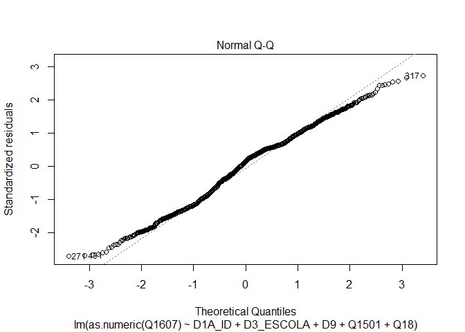

Exercicio 7
================
Carolina Gabriela Dolléans

### No exercício anterior foram feitos alguns modelos bivariados. Agora faça uma regressão multivariada mostrando como a nota atribuída a Jair Bolsonaro (variável Q1607) pode ser explicada pelas variáveis idade (D1A\_ID), educação (D3\_ESCOLA), renda (D9), nota atribuída ao PT (Q1501) e auto-atribuição ideológica (Q18) dos respondentes. Interprete o resultado a partir das informações dadas pelo sumário da regressão.

``` r
setwd("C:\\Users\\Caro\\Desktop\\Mestrado CP\\Analise de dados\\Exercicios\\Exercicio 7")

url <- "https://github.com/MartinsRodrigo/Analise-de-dados/raw/master/04622.sav"

download.file(url, "ESEB_2018.sav", mode = "wb")

library(haven)

banco <- read_sav("ESEB_2018.sav")

library(tidyverse)
library(poliscidata)
```

``` r
banco_filtrado <- banco %>%
  filter(Q1607 < 11) %>%
  filter(D9 < 9999998) %>%
  filter(Q1501 < 11) %>%
  filter(Q18 < 11)
```

**Regressão multivariada entre Q1607, D1A\_ID, D3\_ESCOLA, D9, Q1501,
Q18:**

``` r
regressao <- lm(as.numeric(Q1607) ~ D1A_ID + D3_ESCOLA + D9 + Q1501 + Q18, data = banco_filtrado)
summary(regressao)
```

    ## 
    ## Call:
    ## lm(formula = as.numeric(Q1607) ~ D1A_ID + D3_ESCOLA + D9 + Q1501 + 
    ##     Q18, data = banco_filtrado)
    ## 
    ## Residuals:
    ##     Min      1Q  Median      3Q     Max 
    ## -9.0176 -2.5841  0.4915  2.1784  9.0477 
    ## 
    ## Coefficients:
    ##               Estimate Std. Error t value Pr(>|t|)    
    ## (Intercept)  5.743e+00  4.768e-01  12.044  < 2e-16 ***
    ## D1A_ID       5.816e-03  6.216e-03   0.936  0.34968    
    ## D3_ESCOLA   -1.543e-01  4.469e-02  -3.453  0.00057 ***
    ## D9          -3.067e-05  2.793e-05  -1.098  0.27230    
    ## Q1501       -4.154e-01  2.359e-02 -17.608  < 2e-16 ***
    ## Q18          3.244e-01  2.627e-02  12.349  < 2e-16 ***
    ## ---
    ## Signif. codes:  0 '***' 0.001 '**' 0.01 '*' 0.05 '.' 0.1 ' ' 1
    ## 
    ## Residual standard error: 3.336 on 1456 degrees of freedom
    ## Multiple R-squared:  0.2831, Adjusted R-squared:  0.2806 
    ## F-statistic:   115 on 5 and 1456 DF,  p-value: < 2.2e-16

Primeiramente, observamos que quando todas as outras variáveis são
iguais a zero, a nota atribuída a Bolsonaro é de 5.743, com um p-valor
significativo.

Em seguinte, podemos ver que as variáveis D1A\_ID (idade) e D9 (renda)
não deram resultados estatisticamente significativos. Isso quer dizer
que essas variáveis não melhoram o modelo.

No entanto, as três outras variáveis, D3\_ESCOLA (escola), Q1501 (PT) e
Q18 (auto-atribuição ideológica), deram resultados significativos. Isso
quer dizer que são variáveis que explicam bem a nota a atribuída a
Bolsonaro.

De maneira geral, esse modelo consegue explicar 28% de Q1607, com um
p-valor significativo e um erro de 3.336.

### Em que medida os resultados se mantém ou se alteram quando comparados com os resultados do exercício anterior, quando foram utilizadas apenas regressões bivariadas?

De maneira geral, os resultados se mantêm: as variáveis mais
significativas são as variáveis políticas (Q1501 e Q18). A variável
D3\_ESCOLA também deu significativo, como no teste bivariado. Porém,
nesse modelo, a variável D1A\_ID não deu resultado significativo. E como
na análise bivariada, a variável D9 não deu significativo.

### A partir da exposição de gráficos e testes, avalie se o modelo se adequa aos pressupostos que uma regressão linear exige.

**Pressuposto da linearidade:**

Esse pressuposto é o primeiro por razão óbvia: se queremos fazer uma
regressão linear entre Q1607 e as outras variáveis do modelo, o mínimo é
saber se a relação é de fato linear.

Podemos supor que existe uma relação linear entre Q1607 e idade
(D1A\_ID) porque, geralmente, a medida que a idade avança, o grau de
conservadorismo também. Bolsonaro sendo um candidato conservador por
vários aspectos, poderíamos supor, antes de fazer o modelo, que a nota
atribuida a ele ia aumentar com a idade do respondente. Observamos que o
modelo bivariado deu resultados estatisticamente significativos, mesmo
se fracos. Provavelmente por isso, o modelo multivariavdo mostrou que
D1A\_ID não aumenta a relevância desse modelo.

Podemos supor que existe uma relação linear entre Q1607 e D3\_ESCOLA
(educação) porque, um padrão político comum em outros países é que
pessoas com um alto nível de educação tendem a ter uma posição menos
extrema politicamente. Por isso, poderíamos supor que a medida que o
nível de educação do respondente aumenta, a nota atribuída a Bolsonaro
diminui. Isso é exatamente o que o modelo multivariado mostra, assim que
o modelo bivariado tinha mostrado, ambos com resultados significativos.

Podemos supor que existe uma relação linear entre Q1607 e D9 (renda) um
pouco pelos mesmos motivos que com D3\_ESCOLA. Assim, quem tem uma renda
alta, geralmente, da mesma forma que educação, tem posições políticas
menos extremas, e então, tenderia a atribuir notas mais baixas a
Bolsonaro. Porém, a regressão bivariada do exercício 6 tinha mostrado
que não existia relação linear entre Q1607 e D9. Da mesma forma, o
modelo multivariado indica que a variável D9 não é pertinente para
explicar Q1607. Podemos supor, então, que não existe relação linear
entre D9 e Q1607.

Podemos também supor que existe uma relação linear entre Q1501 (PT) e
Q1607. Assim, parece lógico que mais alguém vai atribuir nota boa ao PT,
mais vai atribuir nota ruim à Bolsonaro, e vice e versa. Isso é
exatamente o que o modelo bivariado mostrou no exercício 6. O modelo
multivariado confirma isso com resultados também significativos para
Q1501.

Enfim, podemos supor que existe uma relação linear entre Q18
(auto-atribuição ideológica) e Q1607. Assim, Bolsonaro é
indubitavelmente um candidato de direita. Então, mais um respondente se
considera de direita, mais deveria atribuir uma nota boa a Bolsonaro.
Isso foi confirmado pelo modelo bivariado e pelo modelo multivariado que
deram, ambos, resultados significativos.

``` r
plot(regressao, 1)
```

<!-- -->

Podemos ver com esse plot que nosso modelo multivariado é quase linear.
Talvez, tirando D9 a linha ficaria mais reta. Antes de 5 (x), a linha se
curva um pouvo abaixo de 0 (y), depois de 5, a linha aumenta um pouco
acima de 0 (y). Então, concluímos que essa linha não é reta.

**Pressuposto da homocedasticidade dos errros:**

``` r
plot(regressao, 3)
```

<!-- -->

Esse gráfico é muito bonito mas não permite dizer, a olho nu, se a
repartição dos pontos é uniforme acima, abaixo e ao longo de x.

``` r
plot(regressao, 1)
```

<!-- -->

Esse gráfico é muito ambíguo. O erro parece ser heterogêneo e homogêneo.
Assim, podemos ver muito claramente que a figura dos pontos possui certa
simetria. Da mesma forma, pegando todos os erros de x, eles se
compensam: os primeiros erros compensam os últimos, os segundos
compensam os penúltimos, etc. Por isso, não sei dizer se é homogêneo ou
heterogêneo. É ainda mais perturbante quando consideramos o fato a média
do erro é com certeza igual a zero aqui.

Vamos verificar a presença ou ausência de homocedasticidade com testes
mais formais:

``` r
library(lmtest)

bptest(regressao)
```

    ## 
    ##  studentized Breusch-Pagan test
    ## 
    ## data:  regressao
    ## BP = 57.067, df = 5, p-value = 4.898e-11

``` r
library(car)

ncvTest(regressao)
```

    ## Non-constant Variance Score Test 
    ## Variance formula: ~ fitted.values 
    ## Chisquare = 23.31391, Df = 1, p = 1.376e-06

Podemos ver, nesses dois testes, que a hipótese nula, ou seja, a
presença de homocedasticidade, pode ser rejeitada. Assim, os p-valores
são significativos e os coeficientes achados são grandes.

Ou seja, o erro não tem uma variação constante ao longo de x.

**Pressuposto da ausência autocorrelação entre os casos e resíduos:**

Esse pressuposto é sobre a ausência de autocorrelação dos erros, ou
seja, sobre a independência dos erros entre si.

``` r
acf(regressao$residuals)
```

<!-- --> Podemos
ver, nesse gráfico, que a maioria dos erros estão dentro do intervalo.
Porém, alguns desses erros chegam no limite do intervalo.

Vamos verificar esse resultado com o teste seguinte:

``` r
durbinWatsonTest(regressao)
```

    ##  lag Autocorrelation D-W Statistic p-value
    ##    1      0.05506583      1.887184   0.044
    ##  Alternative hypothesis: rho != 0

Esse teste deu um p-valor pequeno que nos permite rejeitar a hipótese
nula, ou seja, que nos permite rejeitar a hipótese de que os erros não
são autocorrelacionados. Assim, podemos dizer que os resíduos não são
independentes.

**Pressuposto da normalidade dos residuos:**

``` r
plot(regressao, 2)
```

<!-- --> Podemos
ver, nesse gráfico que, de maneira geral, os pontos estão próximos à
linha diagonal. Porém, eles se desviam um pouco no meio e nas
extremidades.

Vamos verificar isso com o teste seguinte:

``` r
library(MASS)
sresid <- studres(regressao) 
shapiro.test(sresid)
```

    ## 
    ##  Shapiro-Wilk normality test
    ## 
    ## data:  sresid
    ## W = 0.98814, p-value = 1.522e-09

O p-valor é pequeno, ou seja, podemos rejeitar a hipótese nula. Isso
significa que os resíduos não têm uma distribuição normal.

### Caso algum pressuposto não seja satisfeito, quais são as consequências específicas para o modelo estimado?

O pressuposto da linearidade das relações não é satisfeito. Isso implica
que os coeficientes são inconsistentes.

O pressuposto da homocedasticidade dos erros nao é satisfeito pelo
modelo. Isso implica que não podemos confiar nos p-valores (e intervalos
de confiança) do modelo, não podemos confiar na significância
estatística do modelo.

O pressuposto da autocorrelação dos resíduos não é satisfeito pelo
modelo. Da mesma forma que para o pressuposto da homocedasticidade dos
erros, não podemos confiar na significância estatística do modelo.

O pressuposto da normalidade dos resíduos não é satisfeito pelo modelo.
Isso significa que as estimativas do modelo são inconsistentes, por viés
ou por ineficiência.

### Considerando o 4o hurdle do livro *Fundamentals…*, faça um modelo de regressão extra adicionando uma variável **numérica** que foi omitida do modelo anterior, mas que possa ter relação causal com a variável dependente (e talvez alguma associação com as independentes anteriores). Justifique a variável extra e analise o resultado.

Decidi adicionar a variável numérica Q405 que corresponde à questão
“Q04. e) Ter um líder forte no governo é bom para o Brasil mesmo que o
líder não cumpra as regras para fazer as coisas”. Achei essa variável
interessante porque Bolsonaro era visto como um candidato anti-sistema
durante sua campanha. Assim, ele prometia ter um mandato diferente da
velha politica, prometia ser um líder forte que atuasse para o povo e
contra as instituições que, segundo ele, eram corrompidas pelo PT. Sua
grosseiria, seu descontrole e seu politicamente incorreto eram visto
como provas de sinceridade. Por essas razões, acredito que essa variável
possa melhorar nosso modelo.

Supomos que Q405 possui uma relação linear negativa com Q1607 porque
quanto mais baixa a resposta à Q405, mais o respondente concorda que o
Brasil precisa de líder forte.

Porém, temos que levar em conta que Q405 pode ter alguma correlação com
Q18, a auto-atribuição ideológica, mesmo se existem pessoas que
acreditam em líderes fortes na esquerda e na direita do espectro
político.

``` r
banco_filtrado2 <- banco %>%
  filter(Q1607 < 11) %>%
  filter(D9 < 9999998) %>%
  filter(Q1501 < 11) %>%
  filter(Q18 < 11) %>%
  filter(Q405 <7)
```

**Regressão multivariada entre Q1607, D1A\_ID, D3\_ESCOLA, D9, Q1501,
Q18 e Q405:**

``` r
regressao <- lm(as.numeric(Q1607) ~ D1A_ID + D3_ESCOLA + D9 + Q1501 + Q18 + Q405, data = banco_filtrado2)
summary(regressao)
```

    ## 
    ## Call:
    ## lm(formula = as.numeric(Q1607) ~ D1A_ID + D3_ESCOLA + D9 + Q1501 + 
    ##     Q18 + Q405, data = banco_filtrado2)
    ## 
    ## Residuals:
    ##     Min      1Q  Median      3Q     Max 
    ## -9.1994 -2.5799  0.4685  2.2895  8.6778 
    ## 
    ## Coefficients:
    ##               Estimate Std. Error t value Pr(>|t|)    
    ## (Intercept)  6.483e+00  5.025e-01  12.902  < 2e-16 ***
    ## D1A_ID       4.436e-03  6.223e-03   0.713  0.47603    
    ## D3_ESCOLA   -1.300e-01  4.505e-02  -2.885  0.00397 ** 
    ## D9          -2.282e-05  2.789e-05  -0.818  0.41337    
    ## Q1501       -4.178e-01  2.359e-02 -17.712  < 2e-16 ***
    ## Q18          3.147e-01  2.635e-02  11.944  < 2e-16 ***
    ## Q405        -2.376e-01  5.293e-02  -4.488 7.77e-06 ***
    ## ---
    ## Signif. codes:  0 '***' 0.001 '**' 0.01 '*' 0.05 '.' 0.1 ' ' 1
    ## 
    ## Residual standard error: 3.321 on 1441 degrees of freedom
    ## Multiple R-squared:  0.2904, Adjusted R-squared:  0.2875 
    ## F-statistic:  98.3 on 6 and 1441 DF,  p-value: < 2.2e-16

Primeiramente, observamos que quando todas as outras variáveis são
iguais a zero, a nota atribuída a Bolsonaro é de 6.483, com um p-valor
significante.

Em seguinte, podemos ver que as variáveis D1A\_ID (idade) e D9 (renda)
não deram resultados estatisticamente significantes. Isso quer dizer
que essas variáveis não melhoram o modelo, da mesma forma no modelo
anterior.

No entanto, as quatro outras variáveis, D3\_ESCOLA (escola), Q1501 (PT),
Q18 (auto-atribuição ideológica) e Q405 (líder forte), deram resultados
significativos. Isso quer dizer que são variáveis que explicam bem a
nota a atribuída a Bolsonaro.

De maneira geral, esse modelo consegue explicar 29% de Q1607, com um
p-valor significativo e um erro de 3.321, que é um pouco menor do que no
modelo precedente (28% e 3.336).

### Compare o resultado obtido com o modelo e conclusões anteriores.

Podemos ver que o modelo melhorou só um pouco em comparação com o modelo
anterior. Esse modelo explica 29% enquanto o outro explicava 28%. O erro
segue ainda grande: 3.321.

Acredito que uma variável categórica como a P25 ou P26 sobre os meios
pelos quais as pessoas se informam teria sido interessante para
completar esse modelo.
