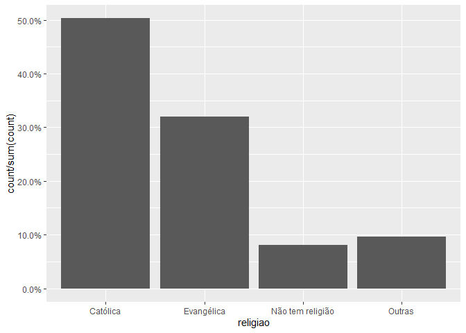

Exercício 8
================
Carolina Gabriela Dolléans

### Continuaremos com a utilização dos dados do ESEB2018. Carregue o banco da mesma forma que nos exercicios anteriores

``` r
library(tidyverse)
library(haven)
library(scales)

setwd("C:\\Users\\Caro\\Desktop\\Mestrado CP\\Analise de dados\\Exercicios\\Exercicio 8")

link <- "https://github.com/MartinsRodrigo/Analise-de-dados/blob/master/04622.sav?raw=true"

download.file(link, "04622.sav", mode = "wb")

banco <- read_spss("04622.sav") 

banco <- banco %>%
  mutate(D2_SEXO = as_factor(D2_SEXO),
         D10 = as_factor(D10)) %>%
  filter(Q1607 < 11)
```

### Começaremos a utilizar no modelo de regressão variáveis qualitativas/categóricas. A primeira delas é sexo (D2\_SEXO). Represente esta variável graficamente.

**Grafico em barra representando D2\_SEXO:**

``` r
ggplot(banco, aes(D2_SEXO)) +
  geom_bar() +
  theme_minimal()
```

<!-- -->

Podemos ver, a partir da observação desse gráfico, que tem mais mulheres
do que homens nesse survey.

### Represente graficamente a associação entre sexo e nota atribuida a Bolsonaro (Q1607)

**Grafico de densidade representando Q1607 em funçao de D2\_SEXO:**

``` r
ggplot(banco, aes(Q1607, fill = D2_SEXO)) +
  geom_density(alpha = 0.3) +
  theme_minimal()
```

<!-- -->

Podemos ver que antes de 2.5/3, a maioria são mulheres. Depois desse
valor, a maioria são homens. Ou seja, homens avaliaram, de maneira
geral, Bolsonaro melhor.

### Teste a associação entre sexo e aprovação de Bolsonaro. Qual é sua conclusão?

**T-Teste entre Q1607 e D2\_SEXO:**

``` r
t.test(Q1607 ~ D2_SEXO, data = banco)
```

    ## 
    ##  Welch Two Sample t-test
    ## 
    ## data:  Q1607 by D2_SEXO
    ## t = 5.88, df = 2324, p-value = 4.693e-09
    ## alternative hypothesis: true difference in means is not equal to 0
    ## 95 percent confidence interval:
    ##  0.6392909 1.2790608
    ## sample estimates:
    ## mean in group Masculino  mean in group Feminino 
    ##                6.020536                5.061360

Os resultados desse t-teste nos mostram que existe sim uma diferença
estatisticamente significativa entre as médias das notas atribuídas a
Bolsonaro por mulheres e por homens. Assim, o p-valor é pequeno, o
intervalo de confiança não contém o 0 e as médias são diferentes.

### Faça uma regressão bivariada com estas duas variáveis, verificando em que medida sexo explica a nota atribuida a Bolsonaro. Interprete o resultado da regressão (o \(\beta\), o \(\alpha\), p-valores e medidas de desempenho do modelo)

**Regressão entre D2\_SEXO e Q1607:**

``` r
regressao1 <- lm(as.numeric(Q1607) ~ D2_SEXO, data = banco)
summary(regressao1)
```

    ## 
    ## Call:
    ## lm(formula = as.numeric(Q1607) ~ D2_SEXO, data = banco)
    ## 
    ## Residuals:
    ##     Min      1Q  Median      3Q     Max 
    ## -6.0205 -4.0614 -0.0205  3.9795  4.9386 
    ## 
    ## Coefficients:
    ##                 Estimate Std. Error t value Pr(>|t|)    
    ## (Intercept)       6.0205     0.1178  51.112  < 2e-16 ***
    ## D2_SEXOFeminino  -0.9592     0.1636  -5.863 5.18e-09 ***
    ## ---
    ## Signif. codes:  0 '***' 0.001 '**' 0.01 '*' 0.05 '.' 0.1 ' ' 1
    ## 
    ## Residual standard error: 3.942 on 2324 degrees of freedom
    ## Multiple R-squared:  0.01458,    Adjusted R-squared:  0.01415 
    ## F-statistic: 34.38 on 1 and 2324 DF,  p-value: 5.178e-09

Podemos ver que quando o respondente é homem, a média de Q1607 é de
6.0205, como o t-teste tinha previsto. Esse resultado é significativo
porque o p-valor é muito pequeno (\< 2e-16\*\*\*).

Observamos também um coeficiente de correlação negativo en D2\_SEXO :
-0.9592. Isso significa que quando a gente passa do grupo “Homens” ao
grupo “Mulheres”, a nota atribuída a Bolsonaro baixa de -0.9592. Esse
resultado é significante porque o p-valor é muito pequeno: 5.18e-09
\*\*\*.

Enfim, esse modelo tem um grande erro de : 3.942; e um R quadrado
pequeno de 0.01458, ou seja, esse modelo explica menos de 2% da nota
atribuída a Bolsonaro. Isso sugere que precisamos de mais variáveis para
explicar a nota atribuída a Bolsonaro.

### Outra variável categórica bastante presente no debate sobre voto na última eleição é religião (D10). Represente esta variável graficamente

``` r
ggplot(banco, aes(D10)) +
  geom_bar() +
  theme_minimal()
```

<!-- -->

Podemos ver, nesse gráfico, que os nomes de religião se confundem.
Podemos tentar modificar os nomes para ver se melhora.

``` r
library(dplyr)

banco_filtrado1 <- banco %>%
  mutate(D10 = case_when(D10 == "Não tem religião" ~ "NTR", 
                        D10 == "Não sabe (Esp.)" ~ "NS",
                        D10 == "Não respondeu (Esp.)" ~ "NR", 
                        D10 == "É ateu/ agnóstico/ Não acredita em Deus" ~ "NA",
                        D10 == "Umbanda" ~ "Um",
                        D10 == "Mórmon, Adventista, Testemunha de Jeová" ~ "MATJ",
                        D10 == "Evangélica" ~ "Ev",
                        D10 == "Espírita kardecista, espiritualista" ~ "Esp",
                        D10 == "Católica" ~ "Cat",
                        D10 == "Candomblé" ~ "Cand",
                        D10 == "Budista" ~ "Bud"))
```

``` r
ggplot(banco_filtrado1, aes(D10)) +
  geom_bar() +
  theme_minimal()
```

<!-- -->

Podemos ver nesse gráfico que as duas religiões principais são católica
e evangelista. A terceira maior resposta é NTR, ou seja, Não tem
religião.

### Crie no banco de dados uma variável de religião modificada chamada `religiao` com as categorias “Evangélica”, “Católica”, “Não tem religião”, e agregue todas as outras na categoria “Outras”.

``` r
Outras <- levels(banco$D10)[-c(3,5,13)]

banco_filtrado2 <- banco %>%
  mutate(religiao = case_when(D10 %in% Outras ~ "Outras",
                              D10 == "Católica" ~ "Católica",
                              D10 == "Evangélica" ~ "Evangélica",
                              D10 == "Não tem religião" ~ "Não tem religião"))


ggplot(banco_filtrado2, aes(religiao, ..count../sum(..count..) )) +
  geom_bar() +
  scale_y_continuous(labels = percent)
```

<!-- -->

### Represente graficamente a associação entre religião e nota atribuída a Bolsonaro

``` r
ggplot(banco_filtrado2, aes(religiao, fill = as.factor(Q1607))) +
    geom_bar(position = "fill") +
    theme_minimal()
```

<!-- -->

Primeiramente, isso é o gráfico mais bonito que já criei.

Segundamente, podemos ver que os evangelistas são os respondentes que
atribuíram melhoras notas a Bolsonaro. Por ordem descrecente:
evangelistas, católicos, não tem religião e outros. A categoria “outros”
representa os respondentes que menos votaram para Bolsonaro, o que faz
totalmente sentido porque essa categoria agrupa religiões verbalmente
discriminadas e criticadas por Bolsonaro.

### Para fazer o teste estatistico da associação entre as variáveis, não podemos usar o teste-t pois neste caso a variável categórica possui diversos níveis. O adequado é utilizar o teste de ANOVA ou o teste de Kruskal. Abaixo ilustramos como fazer esse teste. O Kruskal-test indica se há diferença entre alguma das categorias da variável e a variável contínua, mas não especifica como as diferentes categorias se diferenciam. Isso pode ser obtido com o teste de Wilcox, que compara os agrupamentos par a par. Como você interpreta esse resultado?

``` r
kruskal.test(Q1607 ~ religiao, data = banco_filtrado2)
```

    ## 
    ##  Kruskal-Wallis rank sum test
    ## 
    ## data:  Q1607 by religiao
    ## Kruskal-Wallis chi-squared = 61.013, df = 3, p-value = 3.571e-13

``` r
pairwise.wilcox.test(banco_filtrado2$Q1607, banco$religiao,
                     p.adjust.method = "BH")
```

    ## 
    ##  Pairwise comparisons using 
    ## 
    ## data:  banco_filtrado2$Q1607 and banco$religiao 
    ## 
    ## <0 x 0 matrix>
    ## 
    ## P value adjustment method: BH

O Kruskal-test mostra que existe uma diferença estatisticamente
significativa entre as categorias da variável religião em função de
Q1607.

O teste de Wilcox, mais detalhado, mostra que podemos diferenciar
estatisticamente todas as pares de categorias menos a par “Outras” e
“Não tem religião”. Ou seja, ou essas categorias parecem muito uma
com a outra para ser diferenciadas, ou a amostra dessas categorias é
pequena para conseguir um resultado significativo. Eu apostaria na
segunda opção.

### Faça uma regressão linear para verificar em que medida religião explica a avaliação de Bolsonaro. Interprete o resultado da regressão (cada um dos \(\beta\)s, o \(\alpha\), p-valores e medidas de desempenho do modelo)

``` r
regressao2 <- lm(as.numeric(Q1607) ~ religiao, data = banco_filtrado2)
summary(regressao2)
```

    ## 
    ## Call:
    ## lm(formula = as.numeric(Q1607) ~ religiao, data = banco_filtrado2)
    ## 
    ## Residuals:
    ##    Min     1Q Median     3Q    Max 
    ## -6.259 -4.107  0.559  3.741  5.893 
    ## 
    ## Coefficients:
    ##                          Estimate Std. Error t value Pr(>|t|)    
    ## (Intercept)                5.4410     0.1146  47.470  < 2e-16 ***
    ## religiaoEvangélica         0.8184     0.1838   4.452 8.93e-06 ***
    ## religiaoNão tem religião  -0.6325     0.3081  -2.053   0.0402 *  
    ## religiaoOutras            -1.3339     0.2859  -4.665 3.26e-06 ***
    ## ---
    ## Signif. codes:  0 '***' 0.001 '**' 0.01 '*' 0.05 '.' 0.1 ' ' 1
    ## 
    ## Residual standard error: 3.921 on 2322 degrees of freedom
    ## Multiple R-squared:  0.0261, Adjusted R-squared:  0.02484 
    ## F-statistic: 20.74 on 3 and 2322 DF,  p-value: 2.936e-13

Quando a religião é católica (referência), Q1607 vale 5.4410 de maneira
estatisticamente significativa (p-valor \< 2e-16).

Quando passamos de um respondente católico a um respondente evangélico,
Q1607 aumenta de 0.8184 de maneira estatisticamente significativa
(p-valo igual a 8.93e-06).

Quando passamos de um respondente católico a um respondente que não tem
religião, Q1607 diminui de 0.6325 de maneira estatisticamente
significativa (p-valo igual a 0.0402).

Quando passamos de um respondente católico a um respondente de uma
religião da categoria “Outras”, Q1607 diminui de 1.3339 de maneira
estatisticamente significativa (p-valo igual a 3.26e-06).

Além disso, esse modelo tem um RMSE de 3.921, o que é grande. Enfim, o
Multiple R-squared quadrado é igual a 0.0261 e o Adjusted R-squared a
0.02484. Então é um modelo que explica pouco Q1607. Porém, apesar de
explicar pouco, explica com significância estatística visto que o
p-valor é de 2.936e-13.

### Faça uma regressão linear avaliando ao mesmo tempo em que medida religiao e sexo explicam a avaliacao de Bolsonaro. Interprete o resultado de cada um dos coeficientes a partir da representação gráfica destes.

``` r
banco_filtrado3 <- banco %>%
  mutate(religiao = case_when(D10 %in% Outras ~ "Outras",
                              D10 == "Católica" ~ "Católica",
                              D10 == "Evangélica" ~ "Evangélica",
                              D10 == "Não tem religião" ~ "Não tem religião")) %>%
  mutate(D2_SEXO = as_factor(D2_SEXO),
         D10 = as_factor(D10)) %>%
  filter(Q1607 < 11)
```

``` r
regressao3 <- lm(as.numeric(Q1607) ~ religiao + D2_SEXO, data = banco_filtrado3)
summary(regressao3)
```

    ## 
    ## Call:
    ## lm(formula = as.numeric(Q1607) ~ religiao + D2_SEXO, data = banco_filtrado3)
    ## 
    ## Residuals:
    ##     Min      1Q  Median      3Q     Max 
    ## -6.8130 -3.9448  0.1915  3.7365  6.3682 
    ## 
    ## Coefficients:
    ##                          Estimate Std. Error t value Pr(>|t|)    
    ## (Intercept)                5.9493     0.1401  42.477  < 2e-16 ***
    ## religiaoEvangélica         0.8637     0.1825   4.732 2.36e-06 ***
    ## religiaoNão tem religião  -0.6813     0.3057  -2.229   0.0259 *  
    ## religiaoOutras            -1.3130     0.2837  -4.629 3.88e-06 ***
    ## D2_SEXOFeminino           -1.0045     0.1616  -6.215 6.07e-10 ***
    ## ---
    ## Signif. codes:  0 '***' 0.001 '**' 0.01 '*' 0.05 '.' 0.1 ' ' 1
    ## 
    ## Residual standard error: 3.889 on 2321 degrees of freedom
    ## Multiple R-squared:  0.04204,    Adjusted R-squared:  0.04039 
    ## F-statistic: 25.46 on 4 and 2321 DF,  p-value: < 2.2e-16

Quando a religião é católica (referência) e o respondente é homem
(referência), Q1607 vale 5.9493 de maneira estatisticamente
significativa (p-valor \< 2e-16).

Quando passamos de um respondente católico a um respondente evangélico,
Q1607 aumenta de 0.8637 de maneira estatisticamente significativa
(p-valo igual a 2.36e-06).

Quando passamos de um respondente católico a um respondente que não tem
religião, Q1607 diminui de 0.6813 de maneira estatisticamente
significativa (p-valo igual a 0.0259).

Quando passamos de um respondente católico a um respondente de uma
religião da categoria “Outras”, Q1607 diminui de 1.3130 de maneira
estatisticamente significativa (p-valo igual a 3.88e-06).

Quando passamos de um respondente católico a uma respondente católica,
Q1607 diminui de 1.0045 de maneira estatisticamente significativa
(p-valo igual a 6.07e-10).

Além disso, esse modelo tem um RMSE de 3.889, o que é grande. Enfim, o
Multiple R-squared quadrado é igual a 0.04204 e o Adjusted R-squared a
0.04039. Então é um modelo que explica pouco Q1607, mas explica melhor
do que os modelos precedentes. Porém, apesar de explicar pouco, explica
com significância estatística visto que o p-valor é menor do que
2.2e-16.

``` r
library(dotwhisker)

dwplot(regressao3, vline = geom_vline(xintercept = 0))
```

<!-- -->

Todos os coeficientes que observamos nesse gráfico são estatisticamente
significativos porque nenhum contém o zero.

Além disso, podemos observar que a observação “religião evangélica” é
muito diferente das outras. Se eu lembro bem, isso quer dizer que o
modelo seria melhorado se tirassemos essa variável do modelo? Ou seria
melhorado se colocassemos a observação “religiao evangélica” como
referência em vez de “religiao católica”?
