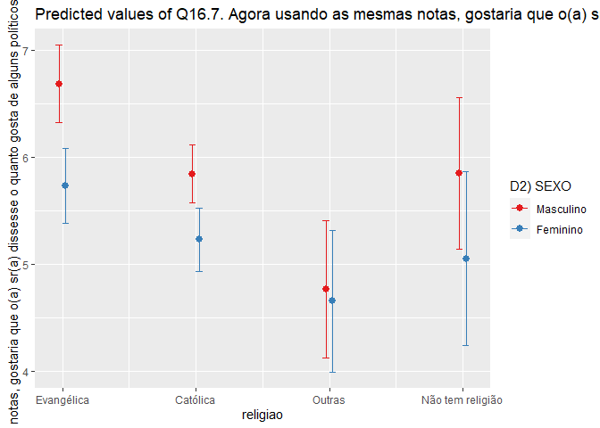

Exercicio 9
================
Carolina Gabriela Dolléans

### Continuaremos com a utilização dos dados do ESEB2018. Carregue o banco da mesma forma que nos exercicios anteriores

``` r
library(tidyverse)
library(haven)
library(scales)

setwd("C:\\Users\\Caro\\Desktop\\Mestrado CP\\Analise de dados\\Exercicios\\Exercicio 9")

link <- "https://github.com/MartinsRodrigo/Analise-de-dados/blob/master/04622.sav?raw=true"

download.file(link, "04622.sav", mode = "wb")

banco <- read_spss("04622.sav") 

banco <- banco %>%
  mutate(D10 = as_factor(D10)) %>%
  filter(Q1607 < 11, 
         Q18 < 11,
         D9 < 9999998,
         Q1501 < 11)
```

### Crie a mesma variável de religião utilizada no exercício anterior

``` r
Outras <- levels(banco$D10)[-c(3,5,13)]

banco <- banco %>%
  mutate(religiao = case_when(D10 %in% Outras ~ "Outras",
                              D10 == "Católica" ~ "Católica",
                              D10 == "Evangélica" ~ "Evangélica",
                              D10 == "Não tem religião" ~ "Não tem religião"))


ggplot(banco, aes(religiao, ..count../sum(..count..) )) +
  geom_bar() +
  scale_y_continuous(labels = percent)
```

<!-- -->

### Faça uma regressão linear avaliando em que medida as variáveis independentes utilizadas nos exercícios 7 e 8, idade(D1A\_ID), educação (D3\_ESCOLA), renda (D9), nota atribuída ao PT (Q1501), auto-atribuição ideológica (Q18), sexo (D2\_SEXO) e religião (variável criada no passo anterior) explicam a avaliação de Bolsonaro (Q1607), mas com uma interação entre as variáveis religião e sexo. Exiba o resultado da regressão e interprete os valores dos coeficientes \(\beta\)s estimados.

### Interprete a significancia estatística dos coeficientes estimados

``` r
regressao <- lm(Q1607 ~ D1A_ID + D3_ESCOLA + D9 + Q1501 + Q18 + D2_SEXO + religiao + religiao*D2_SEXO, data = banco)
summary(regressao)
```

    ## 
    ## Call:
    ## lm(formula = Q1607 ~ D1A_ID + D3_ESCOLA + D9 + Q1501 + Q18 + 
    ##     D2_SEXO + religiao + religiao * D2_SEXO, data = banco)
    ## 
    ## Residuals:
    ##    Min     1Q Median     3Q    Max 
    ## -8.942 -2.561  0.361  2.303  9.052 
    ## 
    ## Coefficients:
    ##                                    Estimate Std. Error t value Pr(>|t|)    
    ## (Intercept)                       6.114e+00  5.915e-01  10.338   <2e-16 ***
    ## D1A_ID                            1.065e-02  6.255e-03   1.703   0.0888 .  
    ## D3_ESCOLA                        -1.134e-01  4.491e-02  -2.524   0.0117 *  
    ## D9                               -3.632e-05  2.768e-05  -1.312   0.1897    
    ## Q1501                            -3.956e-01  2.370e-02 -16.696   <2e-16 ***
    ## Q18                               3.150e-01  2.607e-02  12.083   <2e-16 ***
    ## D2_SEXO                          -6.115e-01  2.438e-01  -2.508   0.0122 *  
    ## religiaoEvangélica                1.181e+00  6.146e-01   1.921   0.0549 .  
    ## religiaoNão tem religião          1.986e-01  1.059e+00   0.188   0.8512    
    ## religiaoOutras                   -1.583e+00  9.503e-01  -1.666   0.0960 .  
    ## D2_SEXO:religiaoEvangélica       -3.412e-01  3.895e-01  -0.876   0.3812    
    ## D2_SEXO:religiaoNão tem religião -1.889e-01  6.979e-01  -0.271   0.7867    
    ## D2_SEXO:religiaoOutras            5.041e-01  6.067e-01   0.831   0.4062    
    ## ---
    ## Signif. codes:  0 '***' 0.001 '**' 0.01 '*' 0.05 '.' 0.1 ' ' 1
    ## 
    ## Residual standard error: 3.297 on 1449 degrees of freedom
    ## Multiple R-squared:  0.3028, Adjusted R-squared:  0.297 
    ## F-statistic: 52.44 on 12 and 1449 DF,  p-value: < 2.2e-16

O intercept corresponde ao valor de Q1607 quando todas as outras
variáveis estão iguais a 0, ou iguais ao valor referência. Então,
corresponde a quando o respondente: tem 16 anos, tem o nível mínino de
educação (analfabeto, nuca frequentou a escola), tem uma renda baixa
(até R$ 954,00 (até 1 salário mínimo)), atribuiu a nota 0 ao PT, se
considera de esquerda, é homem e católico. Nessa situação completamente
hipotética, o respondente atribui a nota seguinte a Bolsonaro: 6.114, de
maneira significativa (p-valor \< 2e-16). Porém, deve ser difícil achar
um tal respondente na realidade, então não vamos concluir nada com esse
intercept.

A variável D1A\_ID (idade) não deu resultado significativo (p-valor =
0.0888), quer dizer que não é uma variável que pode melhorar o modelo.

Controlando as outras variáveis, podemos ver que Q1607 diminui comforme
o nível de educação (D3\_ESCOLA) vai aumentando com um coeficiente de
-1.134e-01, de maneira significativa (p-valor = 0.0117).

A variável D9 (renda) não deu resultado significativo (p-valor =
0.1897), quer dizer que essa variável não pode melhorar o modelo.

Controlando as outras variáveis, podemos ver que Q1607 diminui comforme
a nota atribuida ao PT aumenta (Q1501) com um coeficiente de -3.956e-01,
de maneira significativa (p-valor \< 2e-16).

Controlando as outras variáveis, podemos ver que Q1607 aumenta comforme
a auto-atribuição ideológica (Q18) vai aumentando com um coeficiente de
3.150e-01, de maneira significativa (p-valor \< 2e-16).

Controlando as outras variáveis, podemos ver que Q1607 diminui quando
passamos de um respondente masculino católico a uma respondente feminina
católica (D2\_SEXO) de -6.115e-01, de maneira significativa (p-valor =
0.8512).

Controlando as outras variáveis, podemos ver que Q1607 aumenta quando
passamos de um respondente masculino católico a um respondente masculino
evangélico de 1.181, de maneira significativa (p-valor = 0.0549).

Controlando as outras variáveis, podemos ver que quando passamos de um
respondente masculino católico a um respondente masculino que não tem
religião, o resultado não é significativo (p-valor = 0.0549).

Controlando as outras variáveis, podemos ver que Q1607 diminui quando
passamos de um respondente masculino católico a um respondente masculino
de uma religião da categoria “Outras” de -1.583, de maneira
significativa (p-valor = 0.0960).

Controlando as outras variáveis, podemos ver que Q1607 diminui quando
passamos de um respondente masculino evangélico a uma respondente
feminina evangélica de -3.412e-01, porém, de maneira não significativa
(p-valor = 0.3812).

Controlando as outras variáveis, podemos ver que Q1607 diminui quando
passamos de um respondente masculino que não tem religião a uma
respondente feminina que não tem religião de -1.889e-01, porém, de
maneira não significativa (p-valor = 0.7867).

Controlando as outras variáveis, podemos ver que Q1607 aumenta quando
passamos de um respondente masculino de uma religião da categoria
“Outras” a uma respondente feminina de uma religião da categoria
“Outras” de 5.041e-01, porém, de maneira nao significativa (p-valor =
0.4062).

Visto que são variáveis categóricas, devemos ou não prestar atenção aos
p-valores? Assim, as variáveis apresentadas já correspondem a quase
todos os casos possíveis.

### Faça um gráfico que mostre a interação entre as duas variáveis. Interprete o resultado apresentado

``` r
library(tidyverse)

library(sjPlot)

plot_model(regressao, type = "pred", 
           terms = c("religiao", "D2_SEXO"), 
           ci.lvl = 0.9)
```

<!-- -->

Podemos ver que os dois intervalos que não se sobrepõem são os
intervalos correspondendo aos respondentes evangélicos e católicos.
Assim, nos casos dessas duas religiões, as diferenças entre homens e
mulheres é significativa. No caso dos respondentes de religiões da
categoria “Outras” ou os respondentes que não têm religião, a diferença
entre homens e mulheres é indistinguível porque os intervalos se
sobrepõem.

O único caso significativo previsto pela regressão é a diferença entre
homens e mulheres católicos. O outro caso significativo no gráfico não
deu significância na regressão (evangélicos). Os dois outros casos de
diferenças deram resultados nao significativos no gráfico e na regressão
(não tem religião e outras).
